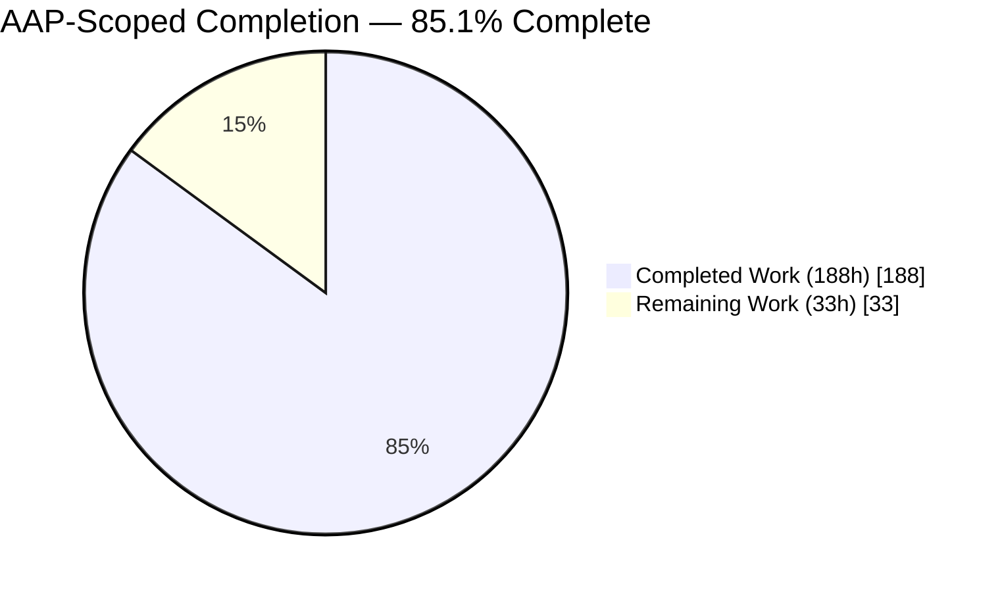
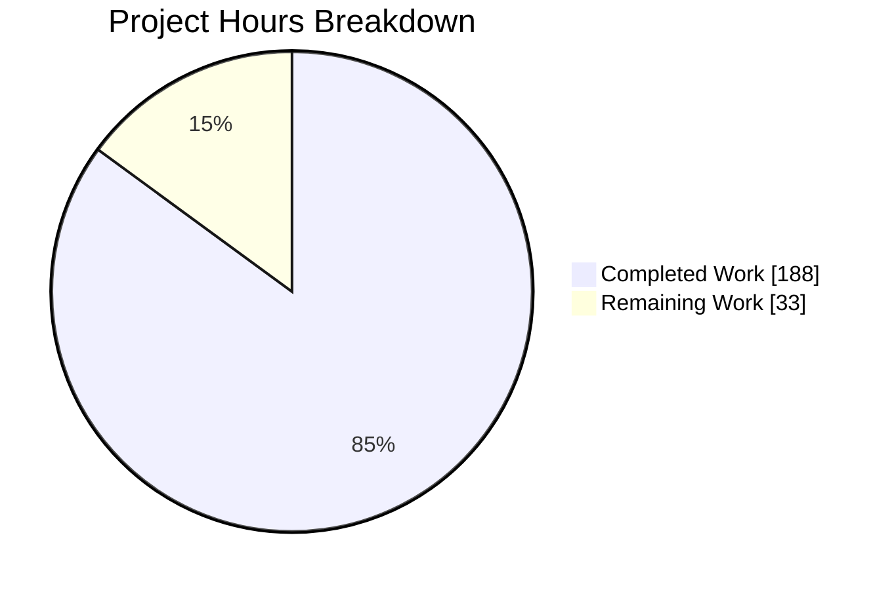
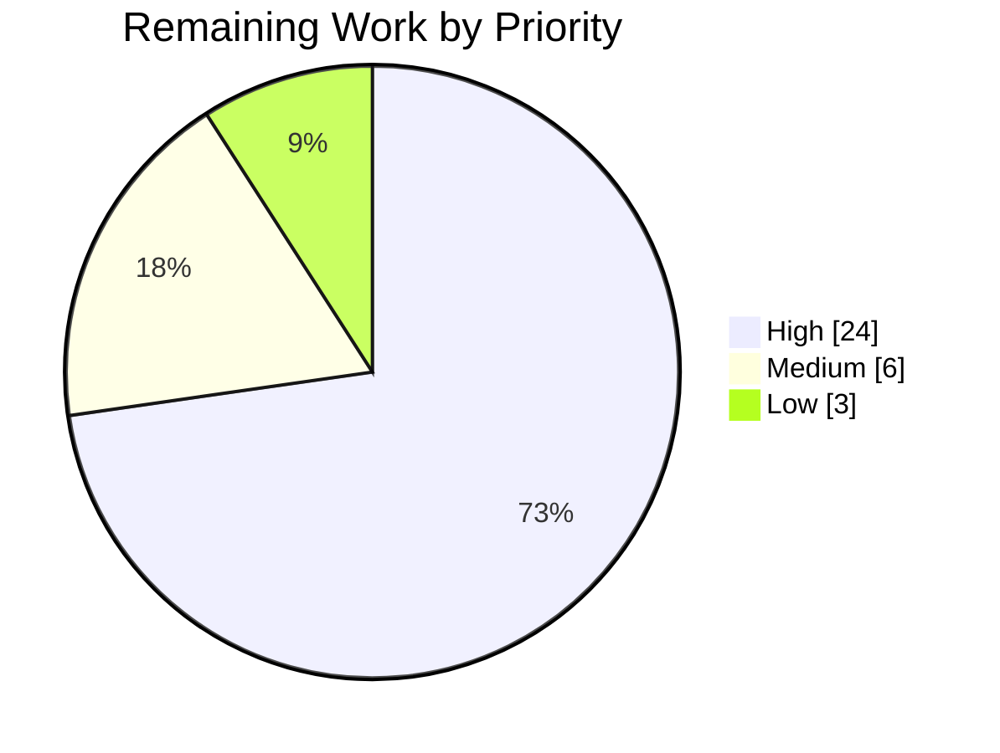
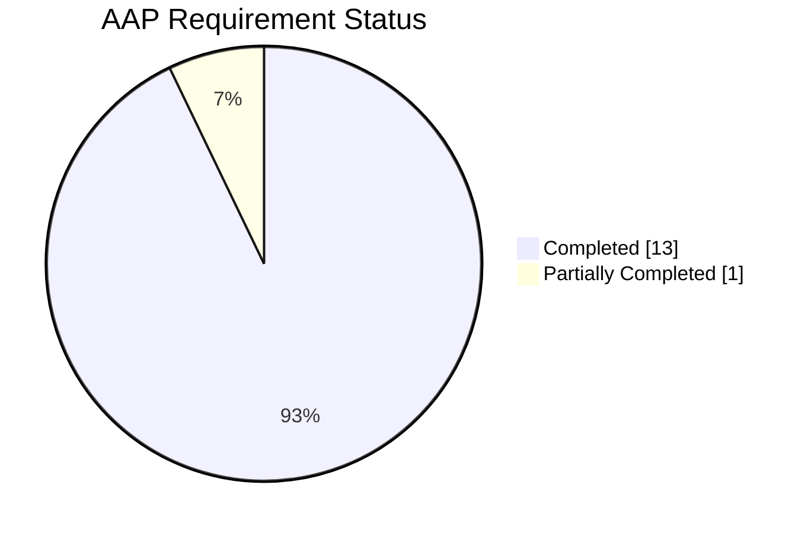

# 1. Executive Summary

## 1.1 Project Overview

This project delivers the executable revival plan for `blitzy-cobol-check`, a fork of the archived `openmainframeproject/cobol-check` COBOL unit-test precompiler at version 0.2.19. The deliverable is a planning artifact, not code: `PROGRAM-PLAN.md` fixes a ten-run sequence that repairs the approval harness, builds a characterization safety net, modernizes the build and identity, corrects defects, adopts the upstream contributions, then adds SQL, file-I/O and CICS mocking and test generation at scale. Alongside it, `upstream-harvest/` preserves a one-time authenticated read of an archived repository — 45 issues, 8 pull requests, both review threads — so the backlog never has to be re-scraped. The reader is the fork's maintainer.

## 1.2 Completion Status



<!-- Completed = Dark Blue #5B39F3 · Remaining = White #FFFFFF -->

| Metric | Value |
| --- | --- |
| **Total Hours** | **221 h** |
| **Completed Hours (AI + Manual)** | **188 h** (188 AI + 0 manual) |
| **Remaining Hours** | **33 h** |
| **Percent Complete** | **85.1 %**  (188 ÷ 221 × 100) |

Scope is the AAP only: the three deliverables, the baseline, the capture, and the path-to-production work that makes the plan usable. Building the ten runs it describes is out of scope.

## 1.3 Key Accomplishments

- ✅ `PROGRAM-PLAN.md` — 3,630 lines: twelve mandated plan items, two standalone run prompts, eight provisional sketches.
- ✅ A re-openable baseline — 347 citations resolve, and an embedded script reproduces all thirteen counts it asserts.
- ✅ All three JDKs measured: 457 tests green on JDK 11 and JDK 8; JDK 21 decomposed into two failure chains.
- ✅ False green proved, not alleged — the harness passes over a 0-byte file by two independent routes.
- ✅ `upstream-harvest/` — 12 artifacts, 37 read-only requests, every count reconciled to GitHub's own counters.
- ✅ A fail-closed gate over that capture: five layers, 33 falsified copies each rejected by the layer that caught it.
- ✅ Both run prompts execute, refusing a wrong repository, a moved pull-request head or a contaminated tree.
- ✅ The fork's product line is untouched: 13 added paths, zero modified, zero deleted.

## 1.4 Critical Unresolved Issues

| Issue | Impact | Owner | ETA |
| --- | --- | --- | --- |
| The thirteen planning artifacts are tracked on the working branch, while the AAP requires them to be committed nowhere | Merging the branch into `Developer` or `main` would put planning material and captured public contributor data into product history permanently. The product refs are measurably clean today | Repository owner | 2 h |
| A live platform credential is embedded in the workspace remote URL and cannot be revoked from inside the container | A credential exposed once stays exposed while valid; the file mode is tightened and no delivered artifact contains a credential value, but the token itself is still good | Platform / repo admin | 2 h |
| The two IBM-derived copybooks await legal review | Blocks the SQL and CICS mocking runs; the plan routes the packaging mechanics per file from the measured verdict, but not the review outcome | Legal + owner | 6 h |
| Four ranked questions are open by construction: consumer acceptance of the one deliberate break, licence permission to read third-party archives as design input, the copybook review, and whether the off-workspace copy of the capture endures | Each blocks a named later run; all four are labelled explicitly rather than answered by assumption | Owner | 2 h |
| The plan's design judgments — run decomposition, fifteen architecture decisions, per-run oracles — have not been accepted by a human | Structure, citations and arithmetic are verified; whether the decisions are the right ones is a judgement no check can make | Owner / architect | 12 h |

## 1.5 Access Issues

| System/Resource | Type of Access | Issue Description | Resolution Status | Owner |
| --- | --- | --- | --- | --- |
| `openmainframeproject/cobol-check` | Read-only HTTPS + REST | Archived and read-only. Reads succeeded at 5,000 requests/hour and the capture is preserved; no further read is possible or permitted | Resolved — capture complete, not repeatable | Owner |
| Workspace `origin` remote | Push credential | The remote URL embeds a platform-issued token that cannot be rotated from inside the container | Open — rotate, then move to a credential-free URL | Platform admin |
| VS Code Marketplace publisher `blitzy` | Publish identity | Not yet provisioned; whether federated workload identity works for an individually-owned publisher cannot be tested here | Open — decide and provision before the modernization run's publish job | Owner |
| IBM Enterprise COBOL, DB2, CICS | Compiler/runtime | Unreachable by design. GnuCOBOL 3.2.0 is the only executable target; the z/OS path is planned as structurally complete and labelled unverified | Accepted constraint | N/A |

## 1.6 Recommended Next Steps

1. **[High]** Copy the thirteen planning paths somewhere durable, re-run the package gate to `VERIFIED`, then delete the branch — do not merge it.
2. **[High]** Rotate the platform credential and move to a credential-free remote with `persist-credentials: false`.
3. **[High]** Commission the copybook legal review and answer the other three ranked questions.
4. **[High]** Read and accept the run sequence, the architecture decisions and the per-run oracles.
5. **[Medium]** Confirm the prompt's entry gates on a product-baseline checkout, then hand Prompt B1 to the first session.

# 2. Project Hours Breakdown

## 2.1 Completed Work Detail

| Component | Hours | Description |
| --- | --- | --- |
| Empirical baseline establishment | 30 | The measured floor the whole plan rests on: JDK 8/11/21 build matrix with verbatim transcripts, `cobc (GnuCOBOL) 3.2.0` recorded as the golden-file anchor, both false-green routes reproduced, committed archives inspected at 200/200/17 entries, the nine-coordinate runtime closure, per-file copybook verdicts, apply-cleanly status for all eight upstream pull requests, third-party remote divergence, and the corpus census |
| One-time upstream capture | 16 | 37 authenticated read-only requests across nine endpoint families against an archived repository: 45 issues, 8 pull requests, both named review threads, six flagged comment threads, pagination proved exhausted |
| Capture audit manifest | 12 | `upstream-harvest/HARVEST-MANIFEST.md`, twelve sections, with a 37-row endpoint table generated from the artifacts themselves, per-artifact record counts, ground-truth corroboration, truncation assessment, itemized omissions and a public-data governance contract |
| Capture validation contract | 10 | `upstream-harvest/capture-envelope.schema.json` plus the five-layer validation gate — tree, strict parse, calendar, schema, arithmetic reconciliation — and 33 falsification cases proving it rejects what it claims to reject |
| Program plan items 1–2 | 12 | Executive summary at 188 words and the 16,600-word verified-baseline section, including the re-derivation appendix that lets every count be re-measured without this session's files |
| Program plan item 3 — run sequence | 14 | Ten runs, each with both discipline labels, entry precondition, success oracle, exit criteria, tag name, `BLOCKED-BY` edges and explicit deferrals; fully package-qualified class and method enumerations for every core and new-code run; all thirteen mandated coverage areas assigned |
| Program plan item 4 — architecture decisions | 12 | Fifteen numbered records, each with the decision, the alternatives considered, why each was rejected, and the run that implements it |
| Program plan item 5 — backlog triage | 12 | All 45 open issues and all 8 pull requests classified and routed, titles reproduced byte-for-byte from the capture, with one canonical routing matrix and the four declared non-goals reasoned rather than dropped |
| Program plan items 6–8 | 12 | Backward-compatibility impact across four named consumers and six surfaces, the correctness strategy with its verified/provisional register, and a ten-entry risk register with likelihood, impact, mitigation and early-warning signal |
| Program plan items 9–12 | 12 | Rollback and recovery including the deliberate red exit state of the first run, the stop condition, the package and containment gates; the handoff template every run emits; four ranked open questions; the four requested-visibility topics |
| Deliverable B — two run prompts | 20 | Two standalone prompts totalling 19,000 words, each carrying all mandated elements and both discipline rule sets verbatim, with fail-closed setup blocks that were executed and negative-tested |
| Deliverable C — eight run sketches | 6 | Provisional half-page scopes for runs 2 through 9, each with scope, both labels, entry precondition, oracle, primary risk, key open question and the decisions it implements |
| Deliverable verification | 20 | Citation resolution, shell syntax and lint over every embedded block, structural and table integrity, verbatim-block byte-identity, self-count agreement, execution of all six published gates, and the three-leg repository regression with the tree restored afterwards |
| **Total** | **188** | Matches Completed Hours in Section 1.2 |

## 2.2 Remaining Work Detail

| Category | Hours | Priority |
| --- | --- | --- |
| Artifact preservation and branch disposal — copy the thirteen paths off the workspace, re-run the package gate, read the plan out, delete the branch without merging | 2 | High |
| Credential rotation and remote hygiene — rotate the platform token, move to a credential-free remote, disable credential persistence in workflows | 2 | High |
| Copybook legal review and the three remaining ranked questions | 8 | High |
| Identity decisions — the repository slug against the mark-removal requirement, and which Marketplace publish identity to provision | 3 | Medium |
| Human design sign-off on the run decomposition, the fifteen architecture decisions and the per-run oracles | 12 | High |
| First-run provisioning — cut a checkout from the product baseline, confirm the prompt entry gates there, hand over Prompt B1 | 3 | Medium |
| Rendered-output read of both markdown deliverables, plus wiring the capture validation gate into a later run's CI gate if the capture is retained in-repository | 2 | Low |
| Acceptance of the four capture artifacts that are permanently partial on audit metadata | 1 | Low |
| **Total** | **33** | High 24 h · Medium 6 h · Low 3 h |

## 2.3 Hours Reconciliation

The completion figure is derived only from AAP scope and the path-to-production work that scope implies:

```
Completed hours   = 188   (Section 2.1 column total)
Remaining hours   =  33   (Section 2.2 column total)
Total hours       = 221   (188 + 33)
Percent complete  = 188 / 221 × 100 = 85.1 %
```

Of the fourteen discrete requirements in scope, thirteen are complete and one is partially complete: the requirement that the planning outputs live outside the repository and be committed nowhere. Its placement half is met and verified — a byte-identical copy of all thirteen artifacts exists off the working tree — while the committed-nowhere half is open and closes with a human action, which is the first row of Section 2.2. Building the ten runs the plan describes is explicitly out of scope and contributes no hours to either column.

# 3. Test Results

Every figure below was produced by executing the command in this workspace and reading the result. Test counts for the Java suites come from the JUnit XML under `build/test-results/test/`, not from console summaries.

| Area / Category | Framework | Tests | Passed | Failed | Coverage | What This Proves |
| --- | --- | --- | --- | --- | --- | --- |
| Product unit suite (JDK 11) | JUnit 5 via Gradle 6.9.4 | 433 | 433 | 0 | Not measured — the coverage gate is defined in `build.gradle` but not wired into `check` | The refactoring safety net every later run leans on is intact and green |
| Product integration suite (JDK 11) | JUnit 5, `*IT` classes | 24 | 24 | 0 | 5 of 5 `*IT` classes executed | Config loading, copybook expansion, suite concatenation, mock handling and result-file output work end to end in-process |
| Cross-JDK compatibility | JUnit 5 on JDK 8 / JDK 21 | 914 (457 × 2) | 687 | 227 | Both non-default JDKs exercised | JDK 8 is fully green, so the shipped Java 8 target is safe; JDK 21 fails in exactly two frame chains — 183 `Unsupported class file major version 65` and 36 `Unknown Java version: 21` — which is what makes the mocking-library bump, not a Gradle change, the unblocker |
| Approval harness, end-to-end COBOL | GnuCOBOL 3.2.0 via `./approvaltest` | 6 programs / 11 suites | 5 programs executed | 1 never launched · 26 assertion failures | The tool really compiles and runs COBOL and emits 332 lines of genuine output — and the committed baseline is 98 lines behind it, which is the stale-baseline condition the first run is designed to end red against |
| Approval harness, false-green routes | GnuCOBOL 3.2.0 via Gradle | 2 routes | 2 reproduced | 0 | Both ways the build can report success over a 0-byte file are real: on a cold tree the launcher is absent, and on a warm tree it is present but not executable. Each exits 0 with zero programs compiled |
| Planning deliverable structure and self-consistency | Purpose-built assertions | 13 invariants | 13 | 0 | Both markdown artifacts, all three deliverables | The plan is internally consistent and re-derivable: 12 program-plan items, 15 architecture records, 2 prompts with every mandated element, 8 sketches × 7 fields, 347 citations resolving with zero out of range, the discipline rule block byte-identical in all three places, the three reference examples verbatim, and the embedded re-derivation script reproducing all 13 counts it asserts |
| Embedded shell content | `bash -n` | 18 blocks | 18 | 0 | Every fenced `bash` block in both artifacts | Every command a later run is told to execute parses, including the guarded delete that resolves and sentinel-checks the repository root before removing anything |
| Capture integrity and published gates | Strict JSON parse, JSON Schema draft-07, the artifacts' own gates | 10 artifacts + 6 gates | 16 | 0 | 37 call records, 6 comment threads, 3 review families | The capture is complete and self-checking: 53 issue-endpoint entries resolve to 45 issues plus 8 pull requests, all 8 target `Developer` and are locked, every thread matches GitHub's own counter, and all six published gates return `VERIFIED` with exit status 0 |

### Not Covered

These capabilities are delivered or specified but no test exercises them. A human should treat each as unproven until the run that owns it lands.

- **The forward design content.** The ten run contracts, the fifteen architecture decisions and the eight run sketches are specifications for work that has not executed. Their labels, oracles, citations and internal consistency are checked mechanically; whether the decisions are correct cannot be tested until the implementing run. Read them as design, not as verified behaviour.
- **The second run's entry assertions.** Both prompts assert the existence of the first run's tag and its handoff document. Neither exists yet, so those two assertions have only been syntax-checked. The same applies to the golden-file portability check, whose target directory the characterization run creates.
- **Third-party remote mutation.** The prompts disable push URLs on the research remotes. That step was linted and dry-run against a stub rather than executed, to avoid altering shared remote state.
- **Automatic enforcement of the capture gate.** The five-layer gate is exercised in both directions — pristine passes, 33 falsified copies each fail — but nothing runs it automatically. The capture has no build or CI integration by design.
- **Nine of the fifteen corpus programs.** The harness invokes six and executed five of them. `BIPM012`, `DB2PROG`, `LONGLINESANDNUMBERS`, `MOCK`, `MOCKPARA`, `REPLAC`, `RETURNCODE`, `TESTNESTED` and `WS88LEVEL` are exercised end to end by nothing today; `DB2PROG` is the only program on the live `SQLCA.cpy` resolution path and `RETURNCODE` contains a suite that deliberately fails at return code 4.
- **Line coverage.** A JaCoCo gate with a thirteen-entry exclusion list exists in `build.gradle` but is not attached to `check`, so no coverage figure was produced by any run here. Wiring it in is scheduled into the modernization run.
- **Rendered markdown.** Both deliverables were verified structurally and by reading, never rendered in a markdown engine.

# 4. Runtime Validation & UI Verification

This project has no HTTP surface, no user interface and no database — the deliverable is a planning document plus a persisted JSON capture, and the product it plans is a command-line precompiler. Runtime validation therefore means driving the toolchain, the build, the COBOL harness and the shipped jar, and reading what they actually do. No browser session applies; nothing was skipped for lack of one.

- ✅ **Environment activation** — `. /etc/profile.d/blitzy-cobolcheck-env.sh` returns 0 and is idempotent; it puts all three JDK homes, GnuCOBOL and a de-duplicated `COB_CFLAGS` (exactly one `-D_FORTIFY_SOURCE=3`) on the environment. Nothing is on `PATH` without it.
- ✅ **Toolchain anchor** — `cobc (GnuCOBOL) 3.2.0`; JDK `1.8.0_492`, `11.0.31`, `21.0.11`; Gradle 6.9.4 through the committed wrapper, resolving offline against a warm cache.
- ✅ **JDK 11 build gate** — `./gradlew --no-daemon clean test` exits 0 with 457 tests and no failures. This is the documented-green configuration and it holds.
- ✅ **JDK 8 build** — exits 0 with 457 tests and no failures, so the Java 8 shipped target is safe.
- ⚠ **JDK 21 build** — exits 1 with 227 of 457 failing, in the two frame chains the plan names. This is the recorded baseline datum, deliberately left unfixed until the modernization run.
- ✅ **Full distribution chain** — `clean build fatJar copyJarToBin copyRunScripts prepareDistribution` exits 0 and produces `bin/cobol-check-0.2.19.jar` at 273,558 bytes.
- ✅ **COBOL execution through the harness** — with the three harness scripts made executable, `./approvaltest` exits 0 having genuinely executed 5 COBOL programs (5 process-completion records), producing 11 test suites, 26 failing assertions and 332 lines of output, with child exit codes `4, 0, 0, 4, 0`.
- ❌ **Harness exit semantics on a cold or unfixed tree** — `clean test approvalTest` exits 0 while compiling nothing: a 0-byte `actual-output.txt` compared against the baseline yields `exit from compare: 0` and a PASS line. Reproduced on a cold tree and again on a warm tree whose launcher is present but not executable.
- ❌ **Command-line exit codes** — `java -jar bin/cobol-check-0.2.19.jar -p NUMBERS` exits **0** with failing COBOL assertions in its own output, while `--version` and `--help` both exit **8**. No pipeline can detect a failure, and the two informational paths look like failures. This is the one deliberate breaking change the plan schedules, and its oracle already exists uncovered at `src/test/cobol/RETURNCODE/ReturnCode-4.cut`.
- ✅ **Capture and gate execution** — all six gates published inside the deliverables were extracted verbatim and run: request accounting (`37 calls 11 rate_limit 36 at the 5000 ceiling ['GET']`), five-layer envelope validation, secret hygiene, governance notes, the external-package gate (`13 of 13 byte-identical`) and the product-history containment gate (`CLEAN` on all three product refs). Every one returned `VERIFIED` with exit status 0.

**Never exercised at runtime.** The z/OS and macOS launcher paths remain dead code and cannot be driven — no IBM runtime is reachable and the macOS construction is commented out. The XML and HTML result formats were not driven here; both are known to throw and both are scheduled for repair. The VS Code extension test harness was not launched: it cannot run from this checkout path because the UNIX socket path exceeds 107 characters, and it requires a copy at a shorter path plus a virtual display.

# 5. Compliance & Quality Review

## 5.1 Compliance Matrix

Status is where each deliverable stands now, measured against the artifact.

| # | Deliverable | Benchmark | Status | Evidence |
| --- | --- | --- | --- | --- |
| 1 | Executive summary and verified baseline | Under 200 words; every baseline claim carries a locator or an explicit unknown | ✅ Pass — 100% | 188 words; 347 citations resolve with zero out of range; the re-derivation appendix reproduces all 13 counts it asserts (`PROGRAM-PLAN.md` A1, A2, A2.13) |
| 2 | Run sequence | Every run states both discipline labels, precondition, oracle, exit criteria, tag, dependencies and deferrals | ✅ Pass — 100% | Ten runs, all fields present per run; package-qualified class and method enumerations for both core runs and all three new-code runs; 25 `BLOCKED-BY` edges; all thirteen coverage areas assigned (A3) |
| 3 | Architecture decisions | Minimum five records, each with alternatives, rejection reasons and implementing run | ✅ Pass — 100% | Fifteen numbered records (A4) |
| 4 | Backlog triage | All 45 issues and 8 pull requests classified and routed or deferred with a reason | ✅ Pass — 100% | 45 of 45 and 8 of 8, titles byte-identical to the capture, one canonical routing matrix, four non-goals reasoned (A5) |
| 5 | Compatibility, correctness and risk | Four named consumers assessed; correctness sourced only from reachable authorities; risk register with likelihood, impact, mitigation and early warning | ✅ Pass — 100% | Six surfaces × four consumers; the in-repository condition table and documented dialect semantics as the only two sources, with a provisional register for anything else; ten risk rows (A6, A7, A8) |
| 6 | Rollback, handoff, open questions and requested visibility | Deliberate red exit state stated in-section; one handoff template; blocking questions only; exactly four visibility topics | ✅ Pass — 100% | The first run's required red and the stop condition in A9; a fourteen-field handoff template in A10; four ranked questions each labelled unknown in A11; exactly four topics in A12 |
| 7 | Two standalone run prompts | Self-contained, all mandated elements, both rule sets verbatim, deliberate duplication preserved | ✅ Pass — 100% | 8,339 and 10,827 words; the activation script as the literal first command in both; the rule block byte-identical in all three locations; the second prompt carries the mandatory reconciliation against the first run's handoff (Deliverable B) |
| 8 | Eight provisional run sketches | Roughly half a page each, not prompts, scope plus six further fields | ✅ Pass — 95% | All eight carry all seven fields and both labels at 279–358 words; the size hint is over-delivered against and disclosed (see 5.2 row 4) |
| 9 | One-time upstream capture and its audit | Complete, non-repeatable, auditable, raw payloads unaltered | ✅ Pass — 100% | 12 artifacts, 37 read-only requests, every count reconciled to GitHub's counters, a twelve-section manifest and a five-layer gate that rejects 33 falsifications |
| 10 | Repository non-interference | No production, test, build or configuration file modified; nothing installed; no write to the archived upstream | ✅ Pass — 100% | `git diff --name-status c79624bd HEAD` reports exactly 13 paths, all added, zero modified, zero deleted; all 37 requests are `GET`; the product refs are clean |
| 11 | Planning-output placement | Outputs written to the session output directory and committed nowhere | ⚠ Partial — 50% | The off-tree copy exists and is byte-identical (`13 of 13 / VERIFIED`); the artifacts are also tracked on the working branch (see 5.2 row 1) |

## 5.2 AAP & Rule Divergences and Gaps

**No user-specified rules exist for this project.** `review_rules` returns exactly `No user rules provided.`, so the rules document is empty: there is no named rule to comply with and none was invented. Enterprise-standard practice was applied in its place, and the plan records that position and carries it into both run prompts. Every divergence below is therefore a departure from the AAP, not from a rule.

| What the AAP/Rule Required | What Was Delivered Instead | Why It Diverged | Impact | Remediation |
| --- | --- | --- | --- | --- |
| Planning outputs written to the session output directory and **committed nowhere** | Both: a byte-identical copy off the working tree, **and** all 13 paths tracked on the working branch | The publication channel and the prohibition point at the same place — uncommitted content is discarded, and rewriting the branch afterwards is forbidden by the AAP itself | The placement half is met; the committed half is not. Product refs are measurably clean, so nothing has reached the product line | Copy the thirteen paths off the workspace, re-run the package gate, read the plan out, delete the branch without merging (Section 2.2, row 1) |
| No credential in world-readable repository metadata | Mode tightened to 0600 and zero credential values in any delivered artifact; the remote URL still embeds the token | The credential is issued and held by the executing platform, and that URL is the channel this branch publishes through | A credential exposed once stays exposed while it remains valid | Rotate or revoke first, then a credential-free remote plus disabled credential persistence (Section 2.2, row 2) |
| The capture artifact set enumerated in the AAP's own table | One additional artifact: `upstream-harvest/capture-envelope.schema.json` | Ten captures had each grown their own local provenance conventions, and prose could not reconcile them | Strictly additive. It is now the contract the validation gate enforces, at version 1.2.0 | None required. Optionally wire the gate into a later run's CI (Section 2.2, row 7) |
| Eight run sketches of "roughly half a page each" | Eight sketches of 279–358 words, measured and stated | Each sketch must carry seven mandated fields, and for the larger runs the enumerated scope *is* the substance | None mechanical. A reader budgeting four pages finds about five | Accept, or apply the compression the plan names as costing least |
| No calendar dates anywhere in the plan | One date appears: a vendor's published retirement of a credential type | It is a property of an external dependency in the same sense a version number is, and the publish design turns on it | None to sequencing — order is still expressed only through dependency edges | None. It is labelled in place as an external fact rather than scheduling |
| Every fact carries a `[path:locator]` or a retrieved URL | One fact cites a command and its observed output instead | The claim is about the relationship between two copies of a file, which no file-and-line reference can express | None. The claim is more checkable this way, not less | None |
| A complete, auditable capture of the archived upstream | Complete payloads; four artifacts permanently partial on audit metadata | Three response bodies and one per-call record were discarded at capture time, and the archive cannot be read again | No harvested issue, pull request, review or comment record is affected — the losses are corroboration probes and a quota document | Accept the partial audit metadata and keep the payload-complete distinction in any later summary (Section 2.2, row 8) |

**Placement.** The AAP is unambiguous that the planning outputs belong outside the fork and are committed nowhere. All thirteen paths are tracked on the working branch, and the plan says so itself rather than claiming otherwise: `PROGRAM-PLAN.md` A9.1 states the requirement, the observed state, the cause and the consequences, and A9.1.2 supplies a gate that walks every product ref and reports any planning path present. Running it here returned `CLEAN` on `refs/remotes/origin/Developer`, `refs/heads/Developer` and `refs/tags/0.1.0`. `origin/Developer` is still at the pre-project baseline `c79624bd`, and only the working branch contains this head. Decide between deleting the branch after reading the plan out of it, or amending the plan of record to reflect how output is published.

**Credential exposure.** `git config --get remote.origin.url` matches `://[^/@]+@`, meaning the workspace remote carries userinfo, and the config file was world-readable. The mode is now 0600, both run prompts open with a credential-hygiene step that never echoes a remote URL, and their output contracts hard-fail on credential *values*. An independent scan across all thirteen delivered artifacts and their exported copies found no credential value at all. What remains is outside any in-container remedy: the token is platform-issued and cannot be revoked from here. Rotate it, then replace the remote with a credential-free public URL and set `persist-credentials: false` on every `actions/checkout` step.

**The extra capture artifact.** `upstream-harvest/capture-envelope.schema.json` is not in the AAP's artifact table. It exists because the ten captures had drifted into three different record-count conventions and several unenforceable prose claims about authentication and completeness. It is now the normative shape of every capture's provenance envelope, carrying six envelope-level and seven call-level cross-field invariants — a capture cannot claim authentication without an observed ceiling above the unauthenticated one, and cannot claim completeness while itemizing an omission. `HARVEST-MANIFEST.md` §4.4 validates all ten artifacts against it and reports `0 schema error(s)`; the plan records the artifact's authorization basis at A9.1.1. No action is needed beyond deciding whether the gate should also run in CI.

**Sketch sizing.** Deliverable C asks for roughly half a page per run. The eight sketches measure 279 to 358 words — six to seven tenths of a page on the common readings — and the deliverable states those figures with the command that reproduces them. Every claim they do not carry has a fuller home in the run sequence and the architecture records, so nothing is lost. The structural half of the contract holds strictly: all seven mandated fields and both labels in every sketch, and none is a prompt — the two real prompts are twenty-three times longer than the largest sketch. Accept the over-delivery, or apply the compression the plan nominates as costing least.

**The single date.** The plan forbids temporal planning and expresses order only through dependency edges, which it does — 25 of them and no durations. One calendar date survives: a vendor's announced retirement of a global credential type, which the publish design must respect. It is labelled in place as a property of an external dependency, in the same category as a pinned version, and explicitly not as programme scheduling. Nothing in the sequence depends on it. Read it as a constraint on the modernization run's publish identity rather than as a schedule, and no action follows.

**Citation form.** The evidence standard requires a file-and-line locator or a retrieved URL behind every fact. One fact in A9.1 cites a command and the output it produced, because the claim is that two copies of a file are byte-identical — a relationship no single locator can express, and one that no sentence inside a file can honestly attest to about a copy taken afterwards. The deliverable handles this by publishing the check rather than the assertion: fifteen lines that build their path list from the baseline diff so it cannot drift, report `MISSING` distinctly from `DIVERGED`, and make the exit status the verdict. It returns `13 of 13 byte-identical / VERIFIED`. No action is required.

**Partial audit metadata.** Four of the ten captures carry `audit_status: PARTIAL`. In every case the harvested payload is complete and the shortfall is in the provenance record: two repository-object probes and one duplicate listing had their response bodies discarded at capture time, and one authentication-gate request was never itemized. The affected values are recorded as unknown rather than reconstructed, each with an omissions entry naming what survives and forbidding substitution from a sibling artifact. Re-querying is impossible — the upstream repository is archived — and reconstruction would be fabrication. Accept these four as permanently partial, and preserve the payload-complete versus audit-partial distinction in any later summary, because collapsing the two would misrepresent a complete capture as an incomplete one.

# 6. Risk Assessment

These are forward-looking: what can still go wrong when the plan is executed or when the artifacts are handled.

| Risk | Category | Severity | Probability | Mitigation | Status |
| --- | --- | --- | --- | --- | --- |
| The tool reports a passing test for COBOL it silently deleted — every `EXEC SQL`, `EXEC CICS` and batch I/O verb is replaced with a literal `CONTINUE`, and the harness can pass over a 0-byte file | Technical | Critical | Occurring today | "Green" is defined mechanically — a non-zero executed-program count, a non-empty output file and a genuine baseline match — and every run must state its executed count. Both false-green routes are documented with their reproductions | Mitigated in plan; closes when the first two runs land |
| Regenerated golden files are machine-specific: the harness output embeds the absolute repository root 13 times, so its byte length is `26,216 + 13 × root length` | Technical | High | High if unmitigated | A fifth normalization canonicalizes the repository root, with a self-test and a second assertion that no filtered golden file contains an absolute path; both are acceptance criteria of the characterization run | Mitigated in plan; unproven until that run |
| The build cannot run on JDK 21 — 227 of 457 tests fail in two frame chains | Technical | Medium | Occurring today | The mocking library moves to the 5.x line with an explicit `-javaagent` argument and the test bill-of-materials is bounded to the 5.x line on measured class-file evidence; the modernization run's oracle includes the absence of a dynamic-agent warning | Accepted baseline; scheduled |
| A live platform credential remains valid and is embedded in the workspace remote URL | Security | High | Occurring today | File mode tightened, no credential value in any delivered artifact, credential-hygiene entry step and value-shaped output scan in both prompts | Open — needs rotation outside the container |
| Planning artifacts and captured public contributor data reach product history through a branch merge | Operational | High | Low | A containment gate over every product ref (`CLEAN` on all three), entry assertions in both prompts refusing a contaminated starting tree, and a deletion item conditional on a measurement | Mitigated; closes with branch disposal |
| The one-time capture is lost — the upstream repository is archived and read-only, and three response bodies are already unrecoverable | Operational | High | Low | A verified off-tree copy of all thirteen paths, a three-condition deletion gate, and payload completeness kept separate from audit completeness | Mitigated; needs written confirmation the copy endures |
| No run's green claim is verifiable in CI — the workflow installs no COBOL compiler, and it pins a distribution whose compiler differs from the recorded anchor | Integration | High | High until addressed | Adding the compiler is scoped into the characterization run, which must also record the CI-resolved compiler version beside the local one and treat a difference as a golden-file finding | Mitigated in plan |
| A design decision in the run sequence or the architecture records proves wrong once implementation starts | Technical | Medium | Medium | Every run carries a mechanically checkable oracle, a tagged known-good commit to fall back to, and a handoff reconciliation step, so a wrong assumption surfaces at its own run rather than three runs later | Open by construction; human sign-off pending |

# 7. Visual Project Status

**Hours split — 188 h completed of 221 h total, 85.1 % complete.** Completed work is shown in Blitzy Dark Blue (#5B39F3); remaining work in White (#FFFFFF).



**Remaining work by priority — 24 h High, 6 h Medium, 3 h Low (33 h total).**



**Requirement status — 13 of 14 in-scope requirements complete, 1 partially complete, 0 not started.**



**Where the remaining 33 hours sit.**

| Category | Hours | Share |
| --- | --- | --- |
| Human design sign-off | 12 | 36 % |
| Copybook legal review and the three remaining ranked questions | 8 | 24 % |
| Identity decisions (slug, publish identity) | 3 | 9 % |
| First-run provisioning | 3 | 9 % |
| Artifact preservation and branch disposal | 2 | 6 % |
| Credential rotation and remote hygiene | 2 | 6 % |
| Rendered-output read and optional gate wiring | 2 | 6 % |
| Acceptance of partial audit metadata | 1 | 3 % |
| **Total** | **33** | **100 % (shares rounded)** |

# 8. Summary & Recommendations

**What was delivered.** The revival programme for `blitzy-cobol-check` now has an executable plan of record. `PROGRAM-PLAN.md` carries all twelve mandated plan items across 3,630 lines: an empirical baseline whose every claim is cited and re-derivable, a ten-run sequence in which each run declares both discipline labels, an entry precondition, a mechanically checkable oracle, exit criteria, a tag and its dependency edges, fifteen architecture decision records with their rejected alternatives, a full triage of all 45 open upstream issues and all 8 pull requests, a backward-compatibility analysis against the four consumers who actually depend on the tool today, a correctness strategy that admits what cannot be verified without IBM compilers, a ten-entry risk register, a rollback model, a handoff template, four genuinely blocking questions and the four topics the requirements asked to see reasoning on. Two of the ten runs are expanded into complete standalone prompts; the remaining eight are provisional sketches by design. Alongside the plan, `upstream-harvest/` preserves a one-time authenticated read of an archived repository, audited by a twelve-section manifest and defended by a validation gate that rejects 33 distinct falsifications.

**What was verified.** The product's own safety net is intact and was re-measured here: 457 tests across 33 executing classes pass on JDK 11 and on JDK 8, with the JDK 21 failure decomposed into its two real frame chains rather than the ones folklore suggested. The COBOL path was driven end to end — with the harness scripts made executable, five programs genuinely compile and execute, producing 11 test suites and 332 lines of output. Just as importantly, the failure modes were reproduced rather than asserted: the build reports success over a 0-byte file by two independent routes, and the command line exits 0 with failing COBOL assertions while `--version` and `--help` exit 8. Every command a later run is told to execute parses, all six gates the deliverables publish return `VERIFIED`, and the fork's product line is untouched — thirteen paths added, nothing modified, nothing deleted, with `origin/Developer` still at the pre-project baseline.

**What remains.** Thirty-three hours, and almost none of it is authoring. Twelve hours are a human reading and accepting the plan's design judgments — the one property no check can supply. Eight cover the copybook legal review and the three other ranked questions the plan deliberately leaves open rather than guessing. The rest is handling: preserve the thirteen artifacts somewhere durable and dispose of the branch without merging it, rotate the platform credential, settle the repository slug and the Marketplace publish identity, and provision the first implementation session. That places the project at **85.1 % complete** on AAP scope — 188 hours delivered against 221 total. Building the ten runs the plan describes is explicitly outside that scope and is not counted here.

**The critical path.** Rotate the credential and preserve the artifacts first: both are irreversible-loss risks and both take two hours. Then read the plan and sign off the design, because every subsequent run inherits its decisions. Commission the copybook review in parallel, since it blocks two of the later runs but nothing near-term. Only then hand Prompt B1 to an implementation session — and expect it to end with the approval comparison red, which is its documented and required exit state, with the unit suite still green at 457. Success is measurable at each step: a stated non-zero executed-program count, a tagged commit, and a handoff document that reconciles against its predecessor.

**Production readiness.** The plan is ready to execute; the programme it plans is not yet started, and that distinction is deliberate. Two conditions gate handover rather than block it: the artifacts must exist somewhere that outlives this workspace, and the credential must be rotated. Both are hours, not days. The one property to guard through the whole programme is the one the plan leads with — a tool that reports a passing test for code it silently deleted is worse than no tool, which is why "green" is defined mechanically here and why every run must state what it actually compiled.

# 9. Development Guide

Every command below was executed in this workspace and its output observed. Run them from the repository root. Where a command needs a scratch file, create a scratch directory first — never write build logs into the working tree, because the tree must stay clean:

```bash
LOGDIR="$(mktemp -d)"; echo "logs -> $LOGDIR"
```

## 9.1 System Prerequisites

| Requirement | Observed value | Notes |
| --- | --- | --- |
| OS | Ubuntu 25.10, kernel 6.12.85+ | The verification workflow pins `ubuntu-22.04`, which ships a different COBOL compiler build — treat any difference in `cobc --version` as a golden-file finding |
| JDK 8 | 1.8.0_492 | Test leg only; the shipped artifact targets Java 8 bytecode |
| JDK 11 | 11.0.31 | The documented-green configuration and the default |
| JDK 21 | 21.0.11 | Expected to fail the suite today — a recorded baseline datum, not a defect to fix |
| GnuCOBOL | `cobc (GnuCOBOL) 3.2.0` | The golden-file reproducibility anchor. Record it verbatim before any capture |
| Gradle | 6.9.4 via the committed wrapper | Do not bump outside the modernization run |
| Node / npm | v22.23.2 / 11.18.0 | Only for the `vs-code-extension/` subtree |
| Utilities | git 2.51.0, jq 1.8.1, Python 3.13.7, shellcheck 0.10.0 | All present; nothing needs installing |

## 9.2 Environment Setup

Nothing is on `PATH` in a non-login shell. This is the first command of every session, and a probe that fails before it is a probe error, not a finding:

```bash
. /etc/profile.d/blitzy-cobolcheck-env.sh
```

It exports `JDK8_HOME`, `JDK11_HOME`, `JDK21_HOME`, `JAVA_HOME=$JDK11_HOME`, `GRADLE_USER_HOME`, `PATH` and a de-duplicated `COB_CFLAGS`. It is idempotent. Verify it took:

```bash
cobc --version | head -1                      # cobc (GnuCOBOL) 3.2.0
"$JDK8_HOME/bin/java"  -version 2>&1 | head -1
"$JDK11_HOME/bin/java" -version 2>&1 | head -1
"$JDK21_HOME/bin/java" -version 2>&1 | head -1
echo "$COB_CFLAGS" | grep -o '_FORTIFY_SOURCE=[0-9]' | wc -l   # must be 1
git config --get core.autocrlf                                  # must be false
```

The `COB_CFLAGS` check matters: the distribution's packaging defines `_FORTIFY_SOURCE` twice, the compiler writes a redefinition warning to stderr, and the tool pipes the child's stderr into stdout — so a duplicate definition lands in every golden file you capture. `core.autocrlf=false` matters because the COBOL sources are column-significant fixed format.

## 9.3 Dependencies

No installation step is required. Both caches are warm (the Gradle cache is 468 MB, the npm cache 393 MB) and Gradle resolves offline:

```bash
./gradlew --version --offline        # Gradle 6.9.4
```

For the extension subtree only:

```bash
cd vs-code-extension && npm install && npm run compile && cd ..
```

## 9.4 Build and Test

Redirect Gradle output to a file rather than piping it — the process holds the pipe open and an interactive shell will appear to hang:

```bash
# The documented-green gate: exits 0 with 457 tests, 0 failures
JAVA_HOME=$JDK11_HOME ./gradlew --no-daemon clean test > "$LOGDIR/jdk11.log" 2>&1; echo "exit=$?"

# Java 8 leg: exits 0 with 457 tests, 0 failures
JAVA_HOME=$JDK8_HOME  ./gradlew --no-daemon clean test > "$LOGDIR/jdk8.log" 2>&1; echo "exit=$?"

# Java 21 leg: exits 1 with "457 tests completed, 227 failed" — expected, do not fix
JAVA_HOME=$JDK21_HOME ./gradlew --no-daemon clean test > "$LOGDIR/jdk21.log" 2>&1; echo "exit=$?"
```

Read the real totals from the JUnit XML, never from the console summary:

```bash
python3 - <<'EOF'
import glob, xml.etree.ElementTree as ET
c=t=f=e=s=0
for p in sorted(glob.glob('build/test-results/test/TEST-*.xml')):
    r=ET.parse(p).getroot(); c+=1
    t+=int(r.get('tests')); f+=int(r.get('failures'))
    e+=int(r.get('errors')); s+=int(r.get('skipped'))
print(f"classes={c} tests={t} failures={f} errors={e} skipped={s}")
EOF
```

## 9.5 Running the COBOL Harness

Three tracked scripts ship at mode 0644, and Gradle's copy task preserves the source mode — so the launcher it copies is also non-executable. Grant the bits per session; do not commit them outside the run that owns that change:

```bash
chmod +x ./approvaltest ./cobolcheck ./scripts/linux_gnucobol_run_tests
rm -rf bin temp testruns actual-output.txt          # cold reset; `clean` does not remove these
JAVA_HOME=$JDK11_HOME ./gradlew --no-daemon clean build fatJar copyJarToBin \
  copyRunScripts prepareDistribution -x test > "$LOGDIR/build.log" 2>&1; echo "exit=$?"
./approvaltest > "$LOGDIR/harness.out" 2> "$LOGDIR/harness.err"; echo "exit=$?"
```

Then judge it on what actually ran, not on the exit status:

```bash
grep -c 'INF009'      "$LOGDIR/harness.err"   # programs that genuinely executed — expect 5
grep -c 'TESTSUITE:'  actual-output.txt       # expect 11
wc -l -c actual-output.txt                    # expect 332 lines
```

`INF008: About to launch process` is emitted *before* the child starts, so counting it certifies nothing. `INF009` is written only after a child has run. Both go to stderr, so a count taken from `actual-output.txt` reads zero even on a fully successful run.

## 9.6 Example Usage

```bash
java -jar bin/cobol-check-0.2.19.jar -p NUMBERS
```

Expected: a `TESTSUITE:` header, per-case `PASS` / `**** FAIL` lines and `EXPECTED` / `WAS` pairs on stdout, informational `INF0nn` lines on stderr — and **exit status 0 even when cases fail**, while `--version` and `--help` exit 8. That inversion is real; a repair with a new distinct nonzero code is scheduled, and its oracle already exists at `src/test/cobol/RETURNCODE/ReturnCode-4.cut`.

## 9.7 Inspecting the Planning Artifacts

```bash
# Backlog: 45 true issues out of 53 issue-endpoint entries
jq '[.issues[] | select(has("pull_request") | not)] | length' upstream-harvest/issues.json

# The eight upstream pull requests, their origins and lock state
jq -r '.pulls[] | "\(.number)  \(.head.repo.full_name)  base=\(.base.ref)  locked=\(.locked)"' \
  upstream-harvest/pulls.json

# Plan self-checks
grep -c '^[`][`][`]' PROGRAM-PLAN.md                                  # 92 fence lines, balanced
grep -oE '\[[^][]*:L[0-9]+[^][]*\]' PROGRAM-PLAN.md | wc -l           # 347 citations
grep -oE '\[[^][]*:L[0-9]+[^][]*\]' PROGRAM-PLAN.md | sort -u | wc -l # 172 distinct
```

The deliverables also publish their own gates as fenced blocks — request accounting and five-layer envelope validation in `upstream-harvest/HARVEST-MANIFEST.md` §3.2 and §4.4, secret hygiene in §11, governance notes in §12, and the package and containment gates in `PROGRAM-PLAN.md` A9.1. Copy any of them out and run it; each prints its verdict and makes its exit status the answer.

## 9.8 Troubleshooting

| Symptom | Cause | Resolution |
| --- | --- | --- |
| `clean test approvalTest` passes but `actual-output.txt` is 0 bytes | The approval task's shell calls run while Gradle is still configuring the build, before the tasks they depend on execute. On a cold tree the launcher does not exist yet | Build first, grant the execute bits, then run `./approvaltest` directly. Judge the result on the `INF009` count, never on the exit status |
| `Permission denied` or `ERR023: Process failed to start` from the harness | The harness scripts and the copied launcher are mode 0644 | `chmod +x ./approvaltest ./cobolcheck ./scripts/linux_gnucobol_run_tests` and rebuild so the copy inherits the bit |
| A second `clean approvalTest` fails before any task runs | `clean` removes neither `bin/` nor `temp/`, so the harness runs against a stale baseline | `rm -rf bin temp testruns actual-output.txt` for a true cold tree |
| `git status` shows two `build/` archives deleted after a build | `build/libs/cobol-check-0.2.19.jar` and `build/distributions/cobol-check-0.2.19.zip` are *tracked*, and `clean` deletes them; the distribution chain also rewrites the extension's copy | `git checkout -- build/ vs-code-extension/Cobol-check/bin/`, then confirm each blob against `HEAD` with `git hash-object` |
| A Gradle command appears to hang forever | Output was piped into `tail`/`head`; the process keeps the pipe open | Redirect to a file, or background with `nohup` and wait on the pid |
| The extension test harness fails to start | The UNIX socket path exceeds 107 characters from this checkout location | Copy `vs-code-extension` (with its `.vscode-test` directory) to a short scratch directory outside the repository and run `xvfb-run -a npm test` there |
| A compiler warning appears inside captured output | `_FORTIFY_SOURCE` is defined twice and the warning goes to stderr, which the tool forwards to stdout | Keep the de-duplicated `COB_CFLAGS` the activation script exports; stderr is then exactly 0 bytes |

# 10. Appendices

## A. Command Reference

| Purpose | Command | Observed result |
| --- | --- | --- |
| Activate the toolchain (always first) | `. /etc/profile.d/blitzy-cobolcheck-env.sh` | exit 0, idempotent |
| Documented-green gate | `JAVA_HOME=$JDK11_HOME ./gradlew --no-daemon clean test` | exit 0 — 457 tests, 0 failures |
| Java 8 leg | `JAVA_HOME=$JDK8_HOME ./gradlew --no-daemon clean test` | exit 0 — 457 tests, 0 failures |
| Java 21 leg | `JAVA_HOME=$JDK21_HOME ./gradlew --no-daemon clean test` | exit 1 — 227 of 457 fail (expected) |
| Full distribution chain | `./gradlew --no-daemon clean build fatJar copyJarToBin copyRunScripts prepareDistribution -x test` | exit 0 — `bin/cobol-check-0.2.19.jar`, 273,558 B |
| Cold reset before a harness run | `rm -rf bin temp testruns actual-output.txt` | Removes what `clean` leaves behind |
| Grant harness execute bits (per session) | `chmod +x ./approvaltest ./cobolcheck ./scripts/linux_gnucobol_run_tests` | Tracked mode stays 100644 |
| Run the COBOL harness | `./approvaltest` | exit 0 — 5 programs executed, 11 suites, 332 lines |
| Count programs that genuinely ran | `grep -c 'INF009' <harness stderr>` | 5 |
| Run one suite through the jar | `java -jar bin/cobol-check-0.2.19.jar -p NUMBERS` | exit 0 with failing cases in the output |
| Restore archives `clean` deleted | `git checkout -- build/ vs-code-extension/Cobol-check/bin/` | Blobs match `HEAD` |
| Validate the capture | The `bash` block in `upstream-harvest/HARVEST-MANIFEST.md` §4.4 | `VERIFIED`, exit 0 |
| Check the off-tree artifact copy | The `bash` block in `PROGRAM-PLAN.md` A9.1 | `13 of 13 byte-identical / VERIFIED` |
| Check no planning path reached a product ref | The `bash` block in `PROGRAM-PLAN.md` A9.1.2 | `CLEAN` ×3, `VERIFIED` |

## B. Port Reference

None. This project starts no server, exposes no HTTP endpoint, uses no database and opens no port. The product is a command-line precompiler that shells out to a COBOL compiler.

## C. Key File Locations

| Path | Role |
| --- | --- |
| `PROGRAM-PLAN.md` | The deliverable: Deliverable A items 1–12, two standalone run prompts, eight provisional run sketches |
| `upstream-harvest/issues.json` | All 53 issue-endpoint entries — 45 issues plus 8 pull-request-shaped records |
| `upstream-harvest/pulls.json` | The 8 open pull requests with head SHAs, origin repositories, base ref and lock state |
| `upstream-harvest/pr-330-reviews.json` · `pr-411-reviews.json` | The two named review threads: 2/3/5 and 0/0/0 across the three families |
| `upstream-harvest/issue-comments/{53,93,150,220,321,323}.json` | The six flagged comment threads, each reconciled to its issue counter |
| `upstream-harvest/HARVEST-MANIFEST.md` | Twelve-section audit of the capture, including the generated 37-row endpoint table |
| `upstream-harvest/capture-envelope.schema.json` | The normative provenance-envelope contract (version 1.2.0) the validation gate enforces |
| `build.gradle` | Single build script; the approval task, its configuration-time shell calls and the comparison helper all live here |
| `expected-output.txt` | The approval baseline — 234 lines, currently 98 behind real output. Load-bearing; never delete it |
| `src/main/cobol/` · `src/test/cobol/` | 15 COBOL programs and 23 test-suite files; the harness invokes six of the programs |
| `scripts/linux_gnucobol_run_tests` | The compiler launcher the tool execs once per program |
| `.github/workflows/VerifyAction.yml` | Runs the suite and the approval task on three operating systems — and installs no COBOL compiler |

## D. Technology Versions

| Component | Version |
| --- | --- |
| GnuCOBOL (`cobc`) | 3.2.0 — the golden-file anchor |
| JDK | 1.8.0_492 / 11.0.31 / 21.0.11 |
| Gradle | 6.9.4 (committed wrapper) |
| JUnit Jupiter | 5.6.1 (engine) / 5.7.0 (params) |
| Mockito | 3.6.0 inline / 3.6.28 JUnit 5 bridge |
| JaCoCo | 0.8.6, gate defined but not attached to `check` |
| Node / npm | v22.23.2 / 11.18.0 |
| Product version | 0.2.19 |

## E. Environment Variable Reference

| Variable | Value / source | Why it matters |
| --- | --- | --- |
| `JDK8_HOME`, `JDK11_HOME`, `JDK21_HOME` | Exported by the activation script | The three-leg build matrix is not runnable without them |
| `JAVA_HOME` | Defaults to `$JDK11_HOME` | Gradle 6.9.4 cannot run on JDK 17 or later |
| `GRADLE_USER_HOME` | The shared Gradle cache directory, exported by the activation script | Holds the warm 468 MB cache; offline dependency resolution depends on it |
| `COB_CFLAGS` | De-duplicated, one `-D_FORTIFY_SOURCE=3` | A duplicate definition puts a compiler warning into every captured golden file |
| `GITHUB_TOKEN` | Platform secret, public read scope | Needed only for the upstream capture, which is complete. Authenticated reads run at 5,000/hour; unauthenticated ones return empty bodies once exhausted |

## F. Developer Tools Guide

- **Reading the plan.** Deliverable A items 3, 4 and 5 are written to be copied whole into a later session — they carry no "see above" references, so a run prompt can embed them without losing meaning.
- **Trusting a number.** Every count the plan asserts about the corpus or the code shape is re-derivable: the block in A2.13 prints each value beside the expectation it claims, and it reproduced all thirteen here.
- **Judging a run's success.** Never read the exit status alone. A run is green only when the suite reports 457 or more tests with no failures, the harness compiled and executed a non-zero number of programs, the output file is non-empty, and the baseline comparison genuinely matched.
- **The one expected red.** The first run repairs the harness without refreshing the stale baseline, so its approval comparison must end red while the unit suite stays green. That red is the evidence the repair worked; reverting it would restore the vacuous pass.
- **Handover between runs.** Runs share no memory. Everything a later run needs travels in a handoff document — the start and end commits, the tag, the compiler version verbatim, changed files with reasons, golden-file status, decisions to respect, new public surface, and deferrals.

## G. Glossary

| Term | Meaning |
| --- | --- |
| Precompiler | The architecture: the tool merges the program under test with its test suites, writes a copy with test code embedded, then compiles and runs the copy. Retained deliberately |
| Stub emission | Today every `EXEC SQL`, `EXEC CICS` and batch I/O verb is replaced with a literal `CONTINUE`. Generalizing that into a dispatch point is the seam all three mocking runs depend on |
| Surface label | Which code a run may touch: non-production, peripheral production, enumerated core, or new code |
| Discipline label | Whether observable behaviour may change: preserving, corrective, or additive. A run states both or it has no oracle |
| Green | All of: the suite at 457+ tests with zero failures; a non-zero executed-program count; a non-empty output file; and a genuine baseline match |
| Vacuous green | A pass produced by comparing an empty output file against the baseline with nothing compiled. Reproducible today by two independent routes |
| Golden file | A captured output file compared byte-for-byte on later runs, which is why the compiler version and the compiler flags are recorded verbatim |
| Characterization corpus | The set of COBOL programs, copybooks and suites a later run pins under golden files before anything touches the interpreter |
| Handoff artifact | The single document by which one run passes context to the next |
| Audit-partial capture | A capture whose harvested payload is complete but whose provenance record has an unrecoverable gap. Four of the ten captures are in this state permanently |
