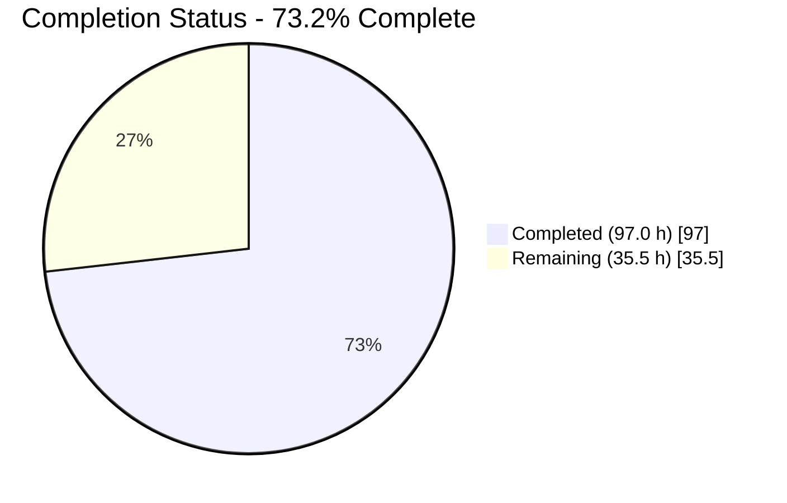
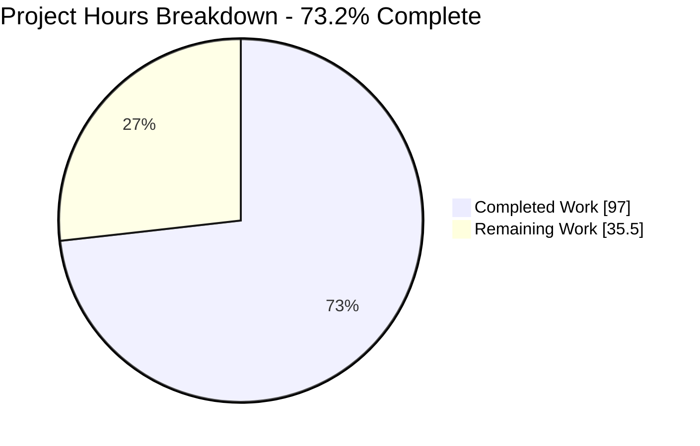
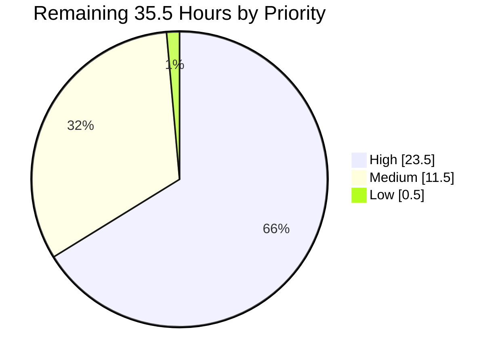
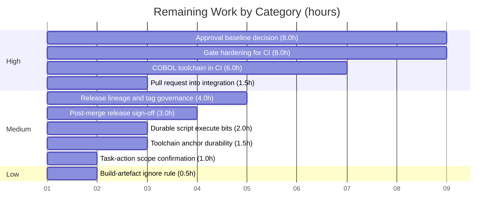

# 1. Executive Summary

## 1.1 Project Overview

`cobol-check` is a COBOL unit-testing precompiler: it merges test suites into a COBOL program, compiles it with GnuCOBOL, runs it and reports results. Its Gradle build carries an approval gate comparing the harness's live output against an approved baseline — the only automated protection over the product's observable output format. That gate could not fail. Its body ran while Gradle was still evaluating the build script, so no COBOL was compiled, and its comparator reported a zero-byte capture as identical to a 234-line baseline. This work makes the gate capable of reporting the truth, and proves it does.

## 1.2 Completion Status

**73.2% complete** — 97.0 of 132.5 hours delivered.



Chart colours: Completed = Dark Blue `#5B39F3`; Remaining = White `#FFFFFF`.

| Metric | Value |
| --- | --- |
| Total Hours | 132.5 |
| Completed Hours (AI + Manual) | 97.0 (97.0 AI + 0 Manual) |
| Remaining Hours | 35.5 |
| Percent Complete | 73.2% |

Calculation: `97.0 / (97.0 + 35.5) × 100 = 73.2%`.

## 1.3 Key Accomplishments

- ✅ The approval gate runs the COBOL harness as a task action, after its inputs are staged, and can fail the build.
- ✅ Five COBOL programs compile and execute per gate run, emitting 11 test suites and a 332-line capture.
- ✅ The comparator cannot report a match without comparing a line; 10 contract tests pin all seven behaviours.
- ✅ Those contract tests run on every Gradle invocation, so the build itself enforces the guarantee.
- ✅ Build-script evaluation does no harness work: `./gradlew tasks` compiles no COBOL and writes no capture.
- ✅ The capture path fails closed against a symlink, a directory or a stale file before the harness launches.
- ✅ The precompiler's 457-test suite is untouched and green on JDK 11 and JDK 8.
- ✅ Both approved baselines are byte-unchanged, so the verdict is measured against the agreed reference.

## 1.4 Critical Unresolved Issues

| Issue | Impact | Owner | ETA |
| --- | --- | --- | --- |
| The gate is honest and therefore red: the live 332-line capture differs from the 234-line approved baseline | Any pipeline running the gate stays red until the baseline is re-approved or the red state is ratified as policy | COBOL product owner | 8 h |
| No pull request exists into the integration branch; creation was refused because the credential lacks `pull_requests: write` | Nothing from this work can land on the integration branch | Repository admin | 1.5 h |
| The gate reports success on any operating system it has no launcher for — nothing runs and nothing is compared | The CI matrix invokes the gate on a macOS runner, where it would pass vacuously | Build owner | 8 h |
| After a successful gate state, a repeat invocation without `clean` reports `UP-TO-DATE` and skips the gate | A job that omits `clean` can certify a stale execution | Build owner | (with row above) |
| No workflow provisions GnuCOBOL, yet the gate is invoked on three runner families | The gate cannot execute meaningfully in CI | CI owner | 6 h |
| The mandated release tag names a commit five behind the delivered tip | The contract's release name is not the delivered state | Release owner | 4 h |

## 1.5 Access Issues

| System/Resource | Type of Access | Issue Description | Resolution Status | Owner |
| --- | --- | --- | --- | --- |
| Repository pull-request API | `pull_requests: write` | Pull-request creation returned HTTP 403; the response named `pull_requests=write` as the missing permission. Read access to the same surface succeeds | Open | Repository admin |
| `blitzy-modernization` integration branch | Write | Direct pushes are prohibited by policy; a pull request is the only permitted route | By design — no action | Release owner |
| SonarCloud (`org.sonarqube` 3.0, `build.gradle:5`) | Analysis token | No token is configured, so no analysis runs. The plugin is resolved from the Gradle plugin portal during configuration, so that host must stay reachable or every Gradle invocation fails | Open | Build owner |
| Upstream research remotes (`upstream`, `gm`, `livingmf`) | Push | Push URLs are disabled; these remotes are fetch-only | By design — no action | — |

## 1.6 Recommended Next Steps

1. **[High]** Open the pull request into the integration branch, or grant the missing permission (1.5 h).
2. **[High]** Decide the approval baseline and move the 11-suite acceptance oracle with it (8 h).
3. **[High]** Provision GnuCOBOL on the CI runners and grant the harness scripts execute permission (6 h).
4. **[High]** Make the gate fail closed on an unsupported platform and non-skippable on repeat (8 h).
5. **[Medium]** Establish one release identity and retire the superseded tag names (4 h).

# 2. Project Hours Breakdown

## 2.1 Completed Work Detail

| Component | Hours | Description |
| --- | --- | --- |
| Approval gate lifecycle repair | 6.0 | The harness invocation moved out of the task registration closure into a task action (`build.gradle:212`), so `dependsOn copyJarToBin, copyRunScripts` (`build.gradle:203`) finally orders the staging tasks ahead of it. Ordering confirmed by log position: configuration, then `clean`, then `copyJarToBin` and `copyRunScripts`, then the gate |
| Build-failure semantics | 1.5 | The FAIL arm throws `GradleException` (`build.gradle:318`) instead of an exception Gradle documents as continuing without failing. The message is preserved character for character; the superseded type survives only inside the explanatory comment |
| Inline comparator removal from the build script | 1.0 | The comparator class was deleted from `build.gradle` in full, leaving the designated blank terminus. The call expression at `build.gradle:309` is unchanged and needs no import |
| Comparator end-of-stream repair | 5.0 | `BuildHelper.compareFiles` now advances both readers unconditionally inside `while (true)` and decides in three ordered steps, so a length difference is observable instead of invisible (`buildSrc/src/main/groovy/BuildHelper.groovy:17`) |
| Zero-comparison guard | 1.0 | A match is refused when no line was compared, so two empty streams cannot be declared identical (`BuildHelper.groovy:21-28`) |
| Comparator relocation into build logic | 2.0 | The class moved to `buildSrc/src/main/groovy/BuildHelper.groovy` in the default package so it can be unit-tested, with no settings change and no import at the call site |
| Build-logic module manifest and test dependency resolution | 4.0 | `buildSrc/build.gradle` in the specified four-block shape, with the test coordinate settled by measurement: the higher candidate aborts the test executor against the pinned distribution's bundled platform, discovering none of the ten methods, while the selected one discovers and passes all ten |
| Comparator contract test suite | 8.0 | Ten JUnit 5 methods across seven behaviour families, both directions of the length and empty-stream cases, and a structurally absent fixture for the error contract asserted in both argument orders (`buildSrc/src/test/groovy/BuildHelperTest.groovy`) |
| Runtime hardening of the task action | 7.0 | Child processes run through a closure that buffers their streams and re-emits them from the task's own thread, so every harness line is attributed to the task; a capture guard refuses a symlink, a non-regular file or an undeletable stale capture; and the `chmod` and harness exit statuses are read, printed and enforced before the comparison |
| Delivery record and evidence dossier | 24.0 | `RUN-1A-HANDOFF.md` — 3,427 lines across fifteen sections: per-criterion evidence, the counting oracles and their two traps, the resolved dependency graph, a seventeen-item deferral register, recorded deviations, and the release provenance |
| Gate-verification protocol and output oracles | 10.0 | The eight-check validation protocol executed repeatedly from cold trees with separated output streams: gate fails, body is an action, configuration is clean, 11 test suites, five programs proven executed from the error stream, 332 lines against the root-length byte formula, contract suite green, no regression |
| Regression verification of the existing Java suites | 5.0 | The root suite plus both filtered task paths re-run and reconciled; the jar staging chain, the equal-length comparison report and the failure message all confirmed unchanged |
| JDK 8 / 11 / 21 compatibility matrix | 3.0 | All three legs executed and recorded, including the supported-runtime floor and the stage at which it now surfaces |
| Adversarial and supply-chain verification | 9.0 | Symlinked, non-regular and stale capture paths; a forced unsupported platform; a repeat invocation after a successful state; a forced close failure proving both readers are attempted; a five-thousand-call descriptor probe; and the nine-component dependency closure checked against upstream checksums, signatures, offline resolution and current advisories |
| Working-tree hygiene and five-path scope discipline | 4.0 | Three tracked binaries restored, three script modes returned, and the generated artefacts removed through a root-anchored guarded procedure, exercised from several dirty states; the change set held to exactly five paths |
| Branch and release-tag publication | 3.5 | The delivered commit published on the run branch with an annotated tag naming it, the protected branches confirmed untouched, and every branch update evidenced as a fast-forward forming an unbroken chain from the starting commit |
| Toolchain and environment alignment | 3.0 | Three JDKs, GnuCOBOL, the mandated compiler-flag anchor and the line-ending setting aligned so the capture is reproducible and the 332-line oracle is measurable |
| **Total** | **97.0** | |

## 2.2 Remaining Work Detail

| Category | Hours | Priority |
| --- | --- | --- |
| Approval baseline decision — justify the 98-line delta, then re-approve the baseline or ratify the red gate as policy, moving the 11-suite oracle with it | 8.0 | High |
| Approval gate hardening for CI — fail closed on an unsupported platform and model the task's real inputs and outputs so a repeat invocation cannot skip it | 8.0 | High |
| COBOL toolchain provisioning in CI — install GnuCOBOL per runner family and grant the harness scripts execute permission | 6.0 | High |
| Release lineage and tag governance — one commit for the five paths, the mandated tag created once against it, superseded names retired | 4.0 | Medium |
| Post-merge release sign-off — re-run the suite and the gate on a CI runner and record the outcome | 3.0 | Medium |
| Durable harness script execute bits, plus a file mode on the script-staging task | 2.0 | Medium |
| Toolchain anchor durability — move the compiler-flag and line-ending settings into provisioning and CI | 1.5 | Medium |
| Pull-request creation into the integration branch | 1.5 | High |
| Task-action scope confirmation — ratify the three runtime-hardening additions inside the gate's action | 1.0 | Medium |
| Build-artefact ignore rule for the build-logic module | 0.5 | Low |
| **Total** | **35.5** | |

## 2.3 Hours Reconciliation

| Check | Value |
| --- | --- |
| Section 2.1 completed total | 97.0 |
| Section 2.2 remaining total | 35.5 |
| Sum (equals Total Hours in Section 1.2) | 132.5 |
| Completion percentage | `97.0 / 132.5 × 100 = 73.2%` |

Every completed hour traces to an Agent Action Plan deliverable or to a verification step the plan mandates. Every remaining hour traces either to a plan requirement not yet fully satisfied — the release identity and the merge route — or to a path-to-production activity required before the repaired gate can be relied upon in a pipeline. Work outside that universe is described in Section 8 and Section 6 but carries no hours here.

Confidence: **High** on the delivered code components and the re-executed verification protocols, whose scope was fixed and whose results were observed. **Medium** on the delivery dossier, the baseline decision and CI provisioning. **Medium-low** on gate hardening, where modelling a test task's real inputs and outputs may prove larger than estimated once attempted.

# 3. Test Results

Every figure below was produced by executing the command named and reading the result — the JUnit XML under `build/test-results/` and `buildSrc/build/test-results/`, or the build's own exit status and output. Nothing is inferred.

| Area / Category | Framework | Tests | Passed | Failed | Coverage | What This Proves |
| --- | --- | --- | --- | --- | --- | --- |
| Precompiler regression suite — JDK 11 (`clean test`) | JUnit 5 Jupiter | 457 | 457 | 0 | Not instrumented | Parsing, interpretation, generation, launching and logging across 33 classes behave exactly as before the build repair; the `unitTest` (433 tests / 28 classes) and `integrationTest` (24 tests / 5 classes) task paths both still execute and partition the suite exactly |
| Precompiler regression suite — JDK 8 (`clean test`) | JUnit 5 Jupiter | 457 | 457 | 0 | Not instrumented | The Java 8 compilation target and runtime still hold, so nothing in the change raised the language floor |
| Approval comparator contract | JUnit 5 Jupiter on Groovy 2.5.12 | 10 | 10 | 0 | 7 of 7 behaviour families | An empty capture, a truncated capture, extra trailing lines, or two empty files can no longer be reported as a match; equal-and-identical still returns match, equal-but-differing still reports the differing line, an unreadable path still returns the error value in both argument orders, and both whitespace-trimming states are pinned. Runs on every Gradle invocation, so the guarantee cannot silently lapse |
| COBOL approval gate — end to end (`clean approvalTest`) | Gradle 6.9.4 + GnuCOBOL 3.2.0 | 11 suites / 6 harness invocations | 5 programs executed (child statuses 4, 0, 0, 4, 0) | Gate verdict FAIL — the required outcome | Not applicable | Real COBOL is compiled and executed and its captured output is adjudicated. The capture is 332 lines and its size matches the documented root-length formula to the byte; the five executions are counted from the error stream, where the product writes them, and read zero in the capture itself. The build exits non-zero with `*** FAIL ***` and the fixed cause |
| Capture-path guard | Gradle 6.9.4 | 2 refusal cases | 2 | 0 | Not applicable | A symlinked capture and a directory in its place are each refused before the harness launches, with a file outside the repository left byte-intact |
| Build lifecycle and configuration purity (`tasks`, `approvalTest --dry-run`) | Gradle 6.9.4 | 2 invocations | 2 | 0 | Not applicable | No harness work happens while the build script is evaluated: no COBOL compiled, no capture written, no comparison run — and the gate's dependency graph resolves in the intended order |
| Supported-runtime floor — JDK 21 (`clean test`) | Gradle 6.9.4 / Groovy 2.5.12 | 1 invocation | 0 | 1 — expected | Not applicable | The build cannot run on JDK 17 or later, and the incompatibility now surfaces at build-logic compilation before any test executes. A recorded environment datum, not a defect of this work |
| Build-logic standalone invocation | Gradle 6.9.4 | 1 invocation | 0 | 1 — expected | Not applicable | The build-logic module is only buildable through a root invocation, because a directory-scoped invocation makes it a standalone project with no Groovy classpath injected. The root-build path is the supported route and exercises the same tests |

### Not Covered

These capabilities were delivered or are relied upon, and **no automated test exercises them**. Each should be tested by hand before release.

- **The Windows harness branch.** `approvaltestWin.cmd` and the Windows path through the gate have never been executed; the host is Linux. The two statements involved are the same closures the Linux branch exercises, but the launcher itself is unverified. Run the gate on a Windows runner.
- **A real macOS host.** The unsupported-platform arm was driven only by forcing the operating-system property; no test asserts its behaviour and no macOS runner has executed it. This matters because the CI matrix includes a macOS leg.
- **Two arms of the capture guard.** The `chmod`-failure arm and the "capture could not be deleted" arm are unreachable as the owning user and are covered by no test. Their sibling arms in the same closure are exercised.
- **The comparator's new branches, through the gate.** The gate's first difference occurs at capture line 5, so control returns before either stream ends — the length-mismatch and both-empty branches are reached only by the contract suite, never by a live gate run.
- **Coverage instrumentation.** A coverage-verification rule is declared with a 0.8 class minimum and thirteen exclusions (`build.gradle:30-50`), but it is attached to no task and no report is produced, so **no coverage percentage exists** for either the precompiler or the build logic. Nothing in this work regressed that; nothing improved it either.
- **The wider COBOL asset set.** 68 COBOL programs and 36 test-suite files are tracked, and the gate exercises the six the harness names — of which five resolve. The remaining programs have no automated gate at all.
- **The delivery record.** `RUN-1A-HANDOFF.md` has no executable surface. It was validated structurally instead: section inventory, table well-formedness, balanced code fences, resolution of every cited repository locator, external link reachability, and a credential-shape scan.

# 4. Runtime Validation &amp; UI Verification

The following flows were driven end to end and observed. Legend: ✅ Operational · ⚠ Partial · ❌ Failing.

- ✅ **Build-script evaluation** — `./gradlew tasks` exits 0 and performs no harness work. A widened probe for every harness marker returns zero across both output streams, and no capture, staging directory or test-run directory is created. Configuration prints only two pre-existing messages: the script-staging notice (`build.gradle:174`) and the project-properties block (`build.gradle:254-264`).
- ✅ **Task graph and staging** — `clearLibJar → fatJar → copyJarToBin → copyRunScripts` all execute ahead of the gate. `bin/cobol-check-0.2.19.jar` is staged at 273,558 bytes and the launcher is staged executable with its version placeholder filled in as `0.2.19`.
- ✅ **COBOL compilation and execution** — five programs run to completion with child statuses 4, 0, 0, 4, 0, emitting 11 test suites into a 332-line capture that is byte-identical across independent cold runs. The staged launcher also runs a single program directly (`./temp/approvalTest/cobolcheck -p NUMBERS`), exiting 0 and emitting a test suite with pass and fail detail lines; the packaged jar prints its usage.
- ✅ **Gate adjudication and build failure** — the comparison returns a failing verdict, `*** FAIL ***` prints, and the build exits non-zero attributing the failure to the throw site with the fixed cause `./expected-output.txt and ./actual-output.txt are different`. Both approved-baseline copies still resolve to the same tracked object at 12,336 bytes afterwards, so the verdict was measured against the agreed reference.
- ✅ **Harness output attribution** — every harness line renders beneath the `> Task :approvalTest` header rather than ahead of it, so the log now reads as the task's own work.
- ✅ **Capture-path safety** — a symlinked capture, a directory and a stale regular file are each refused or replaced before the harness launches. In the symlink case the build fails closed, the harness never starts, and a sentinel file outside the repository is left byte-intact.
- ✅ **Process-status enforcement** — the `chmod` status and the harness's own exit status are read, printed (`harness exit status: 0`) and enforced before the comparison, so a harness that could not run is distinguishable from one whose output merely differs.
- ⚠ **Unsupported-platform path** — driven only by forcing the operating-system property. The task succeeds without executing or comparing anything, and now emits a warning stating exactly that. It has never run on a real macOS host.
- ⚠ **Repeat invocation without `clean`** — after a *successful* gate state the task reports `UP-TO-DATE` and the action is skipped entirely. After a *failing* state a repeat re-executes, so the gap requires a prior success to reach.
- ❌ **Merge route** — no pull request exists into the integration branch. Creation was refused; the branch is published at the delivered commit and the integration branch remains at the starting commit.

**Never exercised at runtime:** the Windows launcher branch, a real macOS host, and the `chmod`-failure and undeletable-capture arms of the capture guard.

**No user interface exists in this project's affected surface.** The delivered change comprises a Gradle build script, a Groovy build-logic class, its test, a build-logic manifest and a Markdown record. There is no HTTP endpoint, no browser surface, no database and no listening socket anywhere in the change, so there was nothing to verify visually and no screenshots were produced. All runtime evidence is command output and build logs.

# 5. Compliance &amp; Quality Review

## 5.1 Compliance Matrix

Each row is the verified state of a deliverable as it stands now.

| Deliverable | Benchmark | Status | Progress |
| --- | --- | --- | --- |
| Approval body runs as a task action | Harness work occurs only in the execution phase, after its inputs are staged | ✅ Pass | ██████████ 100% |
| Gate can fail the build | A failing comparison fails the task and the build with the message unchanged | ✅ Pass | ██████████ 100% |
| Comparator rejects unequal and empty streams | A match is impossible unless both streams ended together and at least one line was compared | ✅ Pass | ██████████ 100% |
| Comparator contract is enforced automatically | Ten contract tests compile and run on every Gradle invocation | ✅ Pass | ██████████ 100% |
| Build logic relocated and unit-testable | Comparator lives in the build-logic module; the call site and settings are unchanged | ✅ Pass | ██████████ 100% |
| Test dependency resolves against the pinned distribution | Exactly one fixed coordinate; launcher and engine generations aligned; all ten methods discovered | ✅ Pass | ██████████ 100% |
| Existing precompiler suite unaffected | 457 tests green with no assertion added, removed, renamed, disabled or narrowed | ✅ Pass | ██████████ 100% |
| Change confined to the agreed surface | Exactly five paths differ from the starting commit; fifteen read-only authority paths show a zero-byte diff | ✅ Pass | ██████████ 100% |
| Approved baselines untouched | Both copies still resolve to the same tracked blob at 12,336 bytes | ✅ Pass | ██████████ 100% |
| Introduced dependency is sound | Nine-component closure from one upstream repository at fixed versions, checksum- and signature-verified, offline-resolvable, no advisory matching the graph, no net-new coordinate | ✅ Pass | ██████████ 100% |
| Gate is trustworthy on every platform it is invoked on | Fails closed when no harness runs; cannot be skipped as up to date | ❌ Fail | ███░░░░░░░ 30% |
| Release delivery chain complete | One commit for the five paths, the mandated tag created once against it, and a pull request into the integration branch | ⚠ Partial | ████░░░░░░ 40% |

## 5.2 AAP &amp; Rule Divergences and Gaps

No user-specified rules were provided for this project, so no rule divergence is possible; the enterprise-standard bar applied instead. Every divergence below is from the Agent Action Plan.

| What the AAP/Rule Required | What Was Delivered Instead | Why It Diverged | Impact | Remediation |
| --- | --- | --- | --- | --- |
| Inside the relocated block, "no statement is added, removed or reordered … the single exception is the type substitution" | Three behavioural additions plus a warning: buffered child-output re-emission, a fail-closed capture guard, and reading and enforcing the process statuses. `build.gradle` grew from 296 to 346 lines | Exercising the relocated code at runtime showed three behaviours the plan's scope did not anticipate — output rendered outside its own task, a capture path that followed symbolic links, and a discarded exit status | None adverse; every acceptance oracle re-measured intact and the capture byte-identical | Ratify the additions (1.0 h, Section 2.2) |
| The comparator's two null-guarded `close()` calls listed under "Preserved exactly" | The same two calls and guards, nested rather than sequential (`BuildHelper.groovy:60-68`) | Sequential statements do not deliver the guarantee the same clause states: a throw from the first close skips the second | Strictly safer; on a double failure the inner exception masks the first | None required |
| Test coordinate `5.14.4` as the primary choice | `5.7.0` (`buildSrc/build.gradle:12`) — **Sanctioned** by the plan's own step-down tree | The higher candidate aborts the test executor against the pinned distribution's bundled platform | Functionally none; the line sits below its upstream support window | None now; revisit with the wrapper |
| One annotated tag, created once, naming the run's final commit, never moved | The mandated name peels five commits behind the delivered tip and its history contains one pre-publication re-point; a separate tag names the delivered commit; the change arrived over eight commits rather than one | Re-pointing a published tag and rewriting published history are forbidden by the same clause | Documentary only — the delivered tree carries all five paths at final state | Establish one release identity (4.0 h) |
| The merge route is a pull request into `blitzy-modernization` | No pull request exists; creation was attempted and refused | The credential lacks `pull_requests: write`; both alternatives are prohibited by the same clause | Nothing from this work can land on the integration branch | Open the pull request or grant the permission (1.5 h) |
| `.gitignore` is on the do-not-modify list | It is unmodified, so build-logic output is never ignored and every Gradle invocation leaves ten untracked entries | The file is excluded from the change, so the remedy had to be procedural | A commit gate enforcing the five-path scope trips unless the cleanup procedure is followed | Add one ignore line (0.5 h) |
| Verify and record the toolchain anchor; install nothing | The mandated compiler-flag value is exported from the container profile and the line-ending setting applied — **Sanctioned** | Without the de-duplicated flag the acceptance oracle is unmeasurable | Positive and load-bearing, but not durable | Move both into provisioning and CI (1.5 h) |
| Three minor shape requirements | A pre-existing comment line removed from the relocated block; two error-contract assertions inside the single mandated test method; and the carried compatibility datum superseded by measurement | Each was directed by review or forced by measurement | None behavioural | None required |

**Task-action additions.** The plan described change (i) as a faithful relocation, so the delivered task action is larger than the plan's diff by roughly fifty lines and a reader is entitled to know why. Exercising the relocated code showed that Groovy pumps a child process's streams on threads Gradle cannot associate with the task's build operation, so the harness log rendered ahead of the task header; that the capture is written with a shell redirection that follows symbolic links, so a planted link redirects a truncating write outside the repository; and that the harness's exit status was never read at all. The additions at `build.gradle:231-246`, `248-266` and `277`/`299-306` address each, and an additive `logger.warn` at `build.gradle:297` states what an unsupported-platform success does not mean. None of the plan's explicit prohibitions is touched — no new task, no new dependency, no up-to-date opt-out, no test framework on the gate, no sixth path. Ratify them: they are the only functional code beyond the specified diff.

**Nested reader closes.** The plan lists the comparator's two null-guarded closes among the elements preserved exactly, and specifies them as consecutive statements. Written that way, a throw from the first close leaves the block immediately and the second reader is never closed — a descriptor leaked into a Gradle daemon that outlives the build. The delivered form nests them so both are always attempted while a failing close still propagates, which upholds the guarantee the same clause states. Groovy 2.5.12, the version the pinned distribution embeds, has no try-with-resources, so nesting is the only construct available. Every verdict, printed message and return value is unchanged, evidenced by ten contract tests passing without edit. One residual: if both closes throw, the inner exception replaces the first.

**Test coordinate step-down.** The plan named `5.14.4` as primary with a pre-authorised fall-back, and the fall-back is what shipped. This is not a judgement recorded after the fact: pinning the higher coordinate makes the test executor abort before discovery, reporting that the platform engine and launcher generations are unaligned, and discovering none of the ten methods. The pinned distribution supplies the launcher itself at the older generation, and the selected coordinate matches it exactly — which is also why the module introduces no net-new artefact. The consequence to accept is that this line sits below its upstream support window, so a future fix on that line is unavailable until the wrapper moves. The two must move together; a lone bump is measurably impossible.

**Release identity.** The plan requires one annotated tag, created once after the final commit, naming it, never moved. What exists instead is a mandated name pointing five commits behind the delivered tip whose history contains one re-point — provable from a surviving unreachable tag object — alongside a separate tag that does name the delivered commit, and three further superseded names. The change also arrived over eight commits rather than the single one the plan describes. Neither shortfall was closable: making the mandated name correct requires re-pointing a published tag, and a single-commit history requires rewriting published history, both forbidden by the clause that mandates the tag. Recovery is unaffected, because a commit resolves to a tree and the delivered tree carries all five paths at final state. Cut one lineage and retire the superseded names.

**Merge route.** The plan is explicit that the work reaches the integration branch through a pull request, never by pushing to it. The run branch is published at the delivered commit and the integration branch is untouched at the starting commit, so the branch half of the route is complete. Creating the pull request was attempted and refused: the response carried HTTP 403 and named `pull_requests=write` as the permission required. Read access to the same surface succeeds, so this is a scope limitation on the credential rather than a repository misconfiguration. The two prohibited alternatives — pushing to the target, or merging locally — were not taken. Either open the pull request from the repository's compare view or grant the permission and retry.

**Build-logic output is not ignored.** The ignore file places `build/*` at the repository root, and a pattern containing a slash is anchored there, so it can never match the nested `buildSrc/build`. Because the build-logic module is compiled and tested on every Gradle invocation, even a read-only command such as `./gradlew tasks` leaves ten untracked entries behind. The ignore file is on the do-not-modify list, so the lawful remedy was procedural: a root-anchored, sentinel-checked cleanup covering the capture, the staging directory, the test-run directory and the build-logic output. That works, and it was exercised repeatedly, but it depends on being followed. One added ignore line retires the problem permanently.

**Toolchain anchor.** The plan's environment discipline is to verify and record, never to install. The frozen anchor it specifies includes a de-duplicated compiler-flag value, and without that value exported the COBOL compiler emits five redefinition warnings and their notes, which the product's launcher routes to standard output and into the capture — inflating it from 332 lines to 340 and making the plan's own acceptance oracle unmeasurable. Aligning the environment to the value the anchor itself specifies was the sanctioned response; nothing was installed into the repository and both settings live outside the tracked tree. The residual is durability: they exist in this container only, and no workflow sets them, so the capture is not yet reproducible elsewhere.

**Minor shape departures.** Three items are behaviourally inert and are recorded so no later reader mistakes them for oversights. A pre-existing comment that merely restated the statement beneath it was removed from inside the relocated block, which shifted every subsequent line number by one. The error-contract test carries two assertions rather than one, in both argument orders, against a path derived beneath a regular file so its absence is structural rather than probabilistic — strictly more coverage inside the mandated ten-method shape. And the carried compatibility datum for the newest runtime, described as a large count of test failures, is superseded: the run now fails earlier, at build-logic compilation, producing no test results at all.

# 6. Risk Assessment

These are forward-looking exposures in the delivered state.

| Risk | Category | Severity | Probability | Mitigation | Status |
| --- | --- | --- | --- | --- | --- |
| The approval gate reports success on any operating system it has no launcher for — nothing is executed and nothing is compared. The CI matrix invokes it on a macOS runner (`.github/workflows/VerifyAction.yml:13`, `29-30`) | Security | High | Medium | Make the arm fail closed, or implement a verified launcher per supported platform, and require a stated executed-program count before success. Currently mitigated only by a warning that names what the success does not mean | Open — 8 h in Section 2.2 |
| After any successful gate state, a repeat invocation without `clean` reports `UP-TO-DATE` and skips the gate entirely | Technical | High | Medium | Model the gate's real inputs and outputs — baseline, harness scripts, staged jar, COBOL sources, compiler environment — rather than relying on callers remembering `clean`. Bounded today: a repeat after a failure re-executes, so a prior success is required | Open — same 8 h |
| No workflow provisions GnuCOBOL, yet the gate is invoked on three runner families, and the harness scripts are tracked without execute permission | Operational | High | High | Install GnuCOBOL per runner, grant the scripts execute permission durably, and set a file mode on the script-staging task so the staged launcher is executable | Open — 6 h + 2 h |
| The gate is red by design against a knowingly stale baseline, so any pipeline running it stays red | Operational | High | High | Decide the baseline: justify the 98-line delta and re-approve it, or ratify the red state as release policy, moving the 11-suite acceptance oracle in the same change | Open — 8 h |
| Invoked outside Gradle, the harness still redirects its capture through a symbolic link and truncates the target | Security | Medium | Low | The Gradle path is guarded and fails closed. Closing the residue means writing the capture into an isolated directory through an operation that refuses to follow links — which requires changing a script excluded from this work | Open — mitigated on the supported path |
| Toolchain floor: the build cannot run on JDK 17 or later, and the test dependency is held below its upstream support window by the pinned wrapper's bundled platform, so neither can move alone | Integration | Medium | Medium | Raise the wrapper and the coordinate together, verifying that all ten contract methods are still *discovered* rather than that the task merely succeeds | Accepted — outside this scope |
| Release identity is ambiguous: five tag names share the run prefix, the mandated one names a commit five behind the delivered tip, and three are not ancestors of it | Operational | Medium | Medium | Cut one lineage, create the mandated tag once against it, and retire the superseded names through governance rather than a local delete | Open — 4 h |
| Absolute workspace paths reach build logs and appear thirteen times inside the capture, produced by the product's output writer | Security | Low | High | Normalise the root at every path that reaches the log, or report a line number and digest with opt-in detail. Discloses directory topology, not credentials, and the fix forces a baseline re-approval | Accepted — outside this scope |

# 7. Visual Project Status

### Overall Progress

Completed = Dark Blue `#5B39F3` · Remaining = White `#FFFFFF`.



### Remaining Work by Priority



### Remaining Hours by Category



### Delivered Change Footprint

| Path | Operation | Lines |
| --- | --- | --- |
| `build.gradle` | Modified | +111 / −61 |
| `buildSrc/build.gradle` | Created | 17 |
| `buildSrc/src/main/groovy/BuildHelper.groovy` | Created | 69 |
| `buildSrc/src/test/groovy/BuildHelperTest.groovy` | Created | 141 |
| `RUN-1A-HANDOFF.md` | Created | 3,427 |

Five paths, 3,765 lines inserted and 61 removed. Fifteen read-only authority paths — all product source, both approved baselines, the harness scripts, the build settings, the wrapper, the workflows and the ignore file — show a zero-byte difference from the starting commit.

# 8. Summary &amp; Recommendations

The approval gate in this build existed to protect the product's observable output format, and it was mechanically incapable of failing. Its entire body sat in the task registration closure, so it ran while Gradle was still evaluating the build script — before the staging tasks it declared a dependency on could exist, let alone run. Every harness invocation died against a launcher that was absent or not executable, wrote nothing, and the comparator then declared a zero-byte capture identical to a 234-line baseline because its loop ended the moment either stream did. A third defect lay dormant behind those two: the failure branch threw an exception type Gradle documents as continuing without failing the build, so repairing the first two alone would have converted the gate from a false pass into a silent no-op. All three are now closed, and the project stands at **73.2% complete — 97.0 of 132.5 hours**.

What the gate does now is verifiable rather than asserted. The harness runs as a task action after its inputs are staged; five COBOL programs compile and execute; the capture is 332 lines carrying 11 test suites, reproducible byte for byte across independent cold runs, and its size matches the documented root-length formula exactly. The comparison rejects it against the approved baseline and the build exits non-zero with the message the contract fixes. Ten contract tests pin every comparator behaviour — unequal lengths in both directions, an empty stream on either side, two empty streams, equal-and-identical, equal-but-differing, the error path in both argument orders, and both whitespace-trimming states — and they run on every Gradle invocation, so the guarantee cannot lapse unnoticed. The precompiler's own 457-test suite is untouched and green on both supported runtimes. The delivered task action also carries three behaviours the plan did not itemise: harness output is attributed to the task that produced it, the capture path is refused unless it is absent or an ordinary file, and the harness's exit status is read and enforced before the comparison. They are the only functional code beyond the planned diff, they are documented as a divergence in Section 5.2, and they should be explicitly ratified.

The remaining 35.5 hours are release enablement, not unfinished repair, and they cluster into four decisions. First, the baseline: a gate that can fail is failing, correctly, against a reference known to be stale by 98 lines — someone must justify that delta and either re-approve the baseline or ratify the red state as policy, moving the 11-suite acceptance oracle with it. Second, the pipeline: no workflow installs GnuCOBOL, yet the gate is invoked on three runner families, and the harness scripts are tracked without execute permission, so CI cannot exercise the gate meaningfully today. Third, trust in the gate itself: it still succeeds on any platform it has no launcher for — including the macOS runner the matrix uses — and a repeat invocation after a successful state is skipped as up to date. Neither could be closed inside the agreed scope, both are bounded by measurement, and both must close before the gate can be relied upon. Fourth, delivery: the work is published on its branch at the delivered commit and the integration branch is untouched, but no pull request exists because the credential lacks permission to create one, and the mandated release tag names a commit five behind the tip.

The critical path is short and ordered. Grant the pull-request permission or open the pull request by hand; take the baseline decision, because it determines whether a green pipeline is even reachable; provision the COBOL toolchain and durable execute permissions so the runners can execute what they are asked to; then harden the gate to fail closed and resist skipping. Establish a single release identity alongside that work, and sign off by re-running the suite and the gate on a real runner. Success is measurable without ambiguity: the suite green at 457 tests on JDK 11 and JDK 8; the contract suite at ten of ten; the capture at 332 lines with 11 suites and five executed programs counted from the error stream; the gate's verdict matching whatever the baseline decision makes correct; and a gate that fails, loudly, on any runner where no COBOL was compiled.

**Production readiness: not ready, by a short and well-understood margin.** The corrective work is complete, verified, and confined to exactly five paths with every excluded authority byte-unchanged. What blocks release is not code quality — it is a deliberate open question about the baseline, a CI environment that cannot run the gate, two fail-open behaviours the agreed scope forbade touching, and a merge route waiting on a permission. None requires rediscovery: each is bounded, costed and owned in Sections 1.4, 2.2 and 6. Two further items are recorded as accepted rather than open, because closing them belongs to a wider modernization: the runtime floor that keeps this build on JDK 11 or older and holds the test dependency below its upstream support window, and the absolute paths the product's output writer places in build logs and in the capture.

# 9. Development Guide

Every command below was executed against this repository and behaves as written. Run all of them from the repository root.

> **Never pipe Gradle output into `head`, `tail` or `grep`.** The daemon holds the pipe open and the shell hangs. Redirect to a file and inspect the file afterwards.

## 9.1 System Prerequisites

| Component | Required | Verified here | Why |
| --- | --- | --- | --- |
| Operating system | Linux (Ubuntu 22.04 or later) | Ubuntu container | Matches the CI runner the build is known to pass on |
| JDK | 11 (default). 8 also works. **17 or later does not** | `openjdk 11.0.31`, `1.8.0_492`, `21.0.11` installed side by side | Gradle 6.9.4 cannot run on JDK 17+ |
| GnuCOBOL | Any 3.x | `cobc (GnuCOBOL) 3.2.0` | The approval gate shells out to `cobc`; without it the gate cannot compile anything |
| Gradle | 6.9.4 — supplied by the wrapper, **do not change the pin** | `Gradle 6.9.4`, embedded `Groovy 2.5.12` | Pinned in `gradle/wrapper/gradle-wrapper.properties` |
| Node.js / npm | Current LTS — only for `vs-code-extension/` | `v22.23.2` / `11.18.0` | The extension subtree is independent of the Gradle build |
| Git | 2.x | `2.51.0` | — |

Hosts that must be reachable over HTTPS: `services.gradle.org` (the wrapper downloads the distribution on first run), **`plugins.gradle.org` and `gradle.org`** (an analysis plugin is fetched during *configuration*, so if these are blocked **every** Gradle invocation fails, including `./gradlew tasks`), `repo.maven.apache.org` and `repo1.maven.org`, the GitHub hosts, and `registry.npmjs.org` for the extension subtree.

## 9.2 Environment Setup

```bash
# Point at JDK 11 - the only configuration this build is documented green on.
export JDK8_HOME=/usr/lib/jvm/java-8-openjdk-amd64
export JDK11_HOME=/usr/lib/jvm/java-11-openjdk-amd64
export JDK21_HOME=/usr/lib/jvm/java-21-openjdk-amd64
export JAVA_HOME="$JDK11_HOME"
export PATH="$JAVA_HOME/bin:$PATH"

# REQUIRED before running the approval harness. Without this exact value the COBOL
# compiler emits five '_FORTIFY_SOURCE' redefinition warnings plus their notes, the
# product's launcher routes them to standard output, and the capture inflates from
# 332 lines to 340 - which breaks the acceptance oracle.
export COB_CFLAGS='-std=c17 -finline-functions -pipe -Wdate-time -D_FORTIFY_SOURCE=3 -Wno-unused -fsigned-char'

# Protects the column-significant fixed-format COBOL sources from line-ending translation.
git config core.autocrlf false

# Somewhere OUTSIDE the repository to keep build logs, so a gate run never dirties the tree.
export LOGDIR="$HOME/cobol-check-logs" && mkdir -p "$LOGDIR"
```

Verify the environment before doing anything else:

```bash
cobc --version | head -1        # cobc (GnuCOBOL) 3.2.0
java -version                   # openjdk version "11.0.31"
./gradlew --version             # Gradle 6.9.4 / Groovy 2.5.12 / JVM 11.0.31
echo "$COB_CFLAGS" | grep -o _FORTIFY_SOURCE | wc -l   # must print exactly 1
```

Recommended Gradle settings in `~/.gradle/gradle.properties` — `console=plain` in particular prevents a single-use daemon from hanging a non-interactive shell:

```properties
org.gradle.jvmargs=-Xmx2g -Dfile.encoding=UTF-8
org.gradle.daemon=true
org.gradle.parallel=false
org.gradle.console=plain
```

Persist `~/.gradle/caches`, `~/.gradle/wrapper/dists` (the 6.9.4 distribution is roughly 431 MB) and `~/.npm` between container starts, or every start re-downloads them.

## 9.3 Build and Test

```bash
# Compile and package. Produces build/libs/cobol-check.jar (unversioned).
./gradlew clean build > "$LOGDIR/build.log" 2>&1; echo "exit=$?"; tail -3 "$LOGDIR/build.log"

# The full precompiler suite. Expect: exit 0, 457 tests, 0 failures.
./gradlew clean test > "$LOGDIR/test.log" 2>&1; echo "exit=$?"

# The two filtered task paths. Expect 433 tests / 28 classes and 24 tests / 5 classes.
./gradlew clean unitTest integrationTest > "$LOGDIR/filtered.log" 2>&1; echo "exit=$?"

# The versioned fat jar, staged where the harness launcher expects it.
# NOTE: 'build' alone does NOT produce this or populate bin/.
./gradlew fatJar copyJarToBin > "$LOGDIR/jar.log" 2>&1; echo "exit=$?"
ls -l bin/cobol-check-0.2.19.jar     # 273,558 bytes
```

Read the real totals from the JUnit XML rather than from console text:

```bash
python3 - <<'PY'
import glob, xml.etree.ElementTree as ET
for task in ('test', 'unitTest', 'integrationTest'):
    files = sorted(glob.glob(f'build/test-results/{task}/*.xml'))
    if not files: continue
    tot = {k: 0 for k in ('tests', 'failures', 'errors', 'skipped')}
    for p in files:
        r = ET.parse(p).getroot()
        for k in tot: tot[k] += int(r.get(k, 0))
    print(task, 'classes=%d' % len(files), tot)
PY
```

The comparator contract suite needs no separate command — the build-logic module is compiled **and tested** on every Gradle invocation. Read its result directly:

```bash
grep -o 'tests="[0-9]*" skipped="[0-9]*" failures="[0-9]*" errors="[0-9]*"' \
  buildSrc/build/test-results/test/TEST-BuildHelperTest.xml
# tests="10" skipped="0" failures="0" errors="0"
```

## 9.4 Running the Approval Gate

The three harness scripts are tracked without execute permission and the staging task preserves source permissions, so grant `+x` first or the staged launcher will not run:

```bash
chmod +x approvaltest cobolcheck scripts/linux_gnucobol_run_tests

# See the gate's dependency graph without running any COBOL.
./gradlew approvalTest --dry-run > "$LOGDIR/dryrun.log" 2>&1; echo "exit=$?"
# :clearLibJar -> :unitTest -> :integrationTest -> :fatJar -> :copyJarToBin
#              -> :copyRunScripts -> :approvalTest

# Run the gate. Capture the two streams SEPARATELY: the product writes every log
# record to standard error, so the execution count is only countable there.
./gradlew clean approvalTest > "$LOGDIR/approval.out" 2> "$LOGDIR/approval.err"
echo "exit=$?"
```

**Expected result today: exit 1.** That is the intended state, not a broken build — the gate is comparing live output against a baseline known to be stale. Confirm it failed for the right reason:

```bash
grep -nE 'Task :approvalTest|Linux detected|harness exit status|exit from compare|\*\*\* FAIL \*\*\*' "$LOGDIR/approval.out"
grep -nE 'What went wrong|Execution failed|are different' "$LOGDIR/approval.err"
```

```text
> Task :approvalTest FAILED
Linux detected
harness exit status: 0
exit from compare: 1
*** FAIL ***
* What went wrong:
Execution failed for task ':approvalTest'.
> ./expected-output.txt and ./actual-output.txt are different
```

Then check the four output oracles:

```bash
grep -c '^TESTSUITE:' actual-output.txt              # 11
wc -l actual-output.txt                              # 332
grep -c INF009 "$LOGDIR/approval.err"                # 5 - the executed-program count
grep -c INF009 actual-output.txt                     # 0 - always; the capture holds stdout only
wc -c actual-output.txt                              # 26216 + 13 * length of your repository root
printf '%s' "$(git rev-parse --show-toplevel)" | wc -c   # your root length
```

Confirm the build script itself runs no harness work:

```bash
./gradlew tasks > "$LOGDIR/tasks.out" 2> "$LOGDIR/tasks.err"; echo "exit=$?"     # exit 0
grep -cE 'Linux detected|exit from compare|harness exit status' "$LOGDIR/tasks.out" "$LOGDIR/tasks.err"   # 0 and 0
```

## 9.5 Restoring the Working Tree

A gate run rewrites tracked build artefacts and leaves generated files behind, some of which the ignore rules do not cover. Run this before committing or comparing:

```bash
ROOT="$(git rev-parse --show-toplevel)"
test -f "$ROOT/build.gradle" && test -f "$ROOT/expected-output.txt" || { echo "not this repository"; exit 1; }
git -C "$ROOT" checkout -- \
  build/distributions/cobol-check-0.2.19.zip \
  build/libs/cobol-check-0.2.19.jar \
  vs-code-extension/Cobol-check/bin/cobol-check-0.2.19.jar
chmod 0644 "$ROOT/approvaltest" "$ROOT/cobolcheck" "$ROOT/scripts/linux_gnucobol_run_tests"
rm -rf "$ROOT/actual-output.txt" "$ROOT/temp" "$ROOT/testruns" "$ROOT/buildSrc/build" "$ROOT/bin"
git -C "$ROOT" status --porcelain=v1 -uall     # expect no output
```

The sentinel check and the absolute paths are deliberate: never run a bare relative `rm -rf`, which inherits whatever directory the shell happens to be in.

## 9.6 Example Usage

Run the precompiler against a single COBOL program through the staged launcher:

```bash
chmod +x approvaltest cobolcheck scripts/linux_gnucobol_run_tests
./gradlew copyRunScripts > "$LOGDIR/stage.log" 2>&1; echo "exit=$?"
./temp/approvalTest/cobolcheck -p NUMBERS > "$LOGDIR/numbers.out" 2> "$LOGDIR/numbers.err"
echo "exit=$?"; head -6 "$LOGDIR/numbers.out"
```

```text
TESTSUITE:
Verify Cobol Check handles numeric relations properly
     PASS:   1. Equal sign with literal compare
**** FAIL:   2. Equal sign with literal compare (should fail)
    EXPECTED +00000000025.7500000
         WAS +00000000025.7400000
```

The failing case above is intentional — the suite includes negative cases by design. Command-line options:

```bash
java -jar bin/cobol-check-0.2.19.jar --help    # prints usage; exits 8, which is its own convention
```

The VS Code extension is an independent subtree:

```bash
cd vs-code-extension && npm install && npm run compile
```

## 9.7 Troubleshooting

| Symptom | Cause | Resolution |
| --- | --- | --- |
| The shell hangs on a Gradle command | The daemon holds an open pipe | Never pipe Gradle. Redirect to a file, then inspect it |
| `cobc: not found`, or the gate fails without compiling | GnuCOBOL is absent from `PATH` | Install GnuCOBOL 3.x and re-check `cobc --version` |
| `Permission denied` from the staged launcher | The harness scripts are tracked at mode 0644 and the staging task preserves source permissions | `chmod +x approvaltest cobolcheck scripts/linux_gnucobol_run_tests` before staging |
| `Unsupported class file major version 65` at `:buildSrc:compileGroovy` | A JDK 17+ runtime | `export JAVA_HOME=$JDK11_HOME` (JDK 8 also works) |
| `Cannot infer Groovy class path because no Groovy Jar was found` | A directory-scoped invocation makes the build-logic module a standalone project, so Gradle never injects its Groovy classpath | Run any root-build command instead; the module's tests execute there anyway |
| `> Task :approvalTest UP-TO-DATE` | The gate declares outputs, so a repeat after a *successful* run skips the action | Always prefix `clean`. Do not add an up-to-date opt-out — record what you see and raise it |
| `… is a symbolic link` / `is not a regular file` / `could not be deleted - refusing to run the approval harness` | The capture guard fired deliberately | Remove `./actual-output.txt`, or replace it with an ordinary file the build may delete |
| Ten untracked entries under `buildSrc/build/` after any Gradle command | The root-anchored ignore rule cannot match a nested path | Use the restore procedure in Section 9.5 |
| The capture's byte size differs between machines | The absolute repository root is embedded thirteen times | Compare the **line** count (332). Bytes are `26216 + 13 × your root length` |
| `approvalTest` is red with `… are different` | The current intended state — the baseline is knowingly stale | Not a build failure. See Section 1.4 and Section 2.2 |

# 10. Appendices

## A. Command Reference

| Command | Purpose | Expected result |
| --- | --- | --- |
| `./gradlew clean build` | Compile and package | exit 0; `build/libs/cobol-check.jar` |
| `./gradlew clean test` | Full precompiler suite | exit 0; 457 tests, 0 failures |
| `./gradlew clean unitTest integrationTest` | Both filtered task paths | exit 0; 433 / 28 classes and 24 / 5 classes |
| `./gradlew fatJar copyJarToBin` | Build and stage the versioned jar | exit 0; `bin/cobol-check-0.2.19.jar`, 273,558 bytes |
| `./gradlew copyRunScripts` | Stage the harness launcher with its version filtered in | exit 0; `temp/approvalTest/cobolcheck` |
| `./gradlew approvalTest --dry-run` | Show the gate's dependency graph without running COBOL | exit 0; thirteen tasks listed in order |
| `./gradlew clean approvalTest` | Run the approval gate | **exit 1 today** — the intended state; `*** FAIL ***` with the fixed cause |
| `./gradlew tasks` | Confirm configuration performs no harness work | exit 0; zero harness markers in either stream |
| `./temp/approvalTest/cobolcheck -p NUMBERS` | Precompile and run one COBOL program | exit 0; a `TESTSUITE:` block |
| `java -jar bin/cobol-check-0.2.19.jar --help` | Command-line usage | usage text; exits 8 by its own convention |
| `JAVA_HOME=$JDK8_HOME ./gradlew clean test` | Java 8 compatibility leg | exit 0; 457 tests, 0 failures |
| `JAVA_HOME=$JDK21_HOME ./gradlew clean test` | Records the runtime floor | exit 1 at `:buildSrc:compileGroovy`; no test results |

## B. Port Reference

Not applicable. This project exposes no network service: the build compiles a command-line precompiler and shells out to a local COBOL compiler. No process in the affected surface listens on a TCP port.

## C. Key File Locations

| Path | Role |
| --- | --- |
| `build.gradle` | Root build. The approval gate is registered at `:201`, its action opens at `:212`, the comparator is called at `:309`, and the failure is thrown at `:318` |
| `buildSrc/build.gradle` | Build-logic module manifest — one test dependency and the platform selection |
| `buildSrc/src/main/groovy/BuildHelper.groovy` | The output comparator. Returns 0 for a match, 1 for a difference, −1 for a comparison error |
| `buildSrc/src/test/groovy/BuildHelperTest.groovy` | Ten contract tests across seven behaviour families |
| `expected-output.txt` | The approved baseline — 234 lines, 12,336 bytes. Duplicated byte-identically at `src/test/approvalTest/expected-output.txt` |
| `actual-output.txt` | The live capture, generated by a gate run. Not tracked |
| `approvaltest` | The Linux harness: six precompiler invocations appending to the capture |
| `approvaltestWin.cmd` | The Windows harness |
| `cobolcheck` / `cobolcheck.cmd` | Launcher templates; the version placeholder is filled in during staging |
| `scripts/linux_gnucobol_run_tests` | The compile-and-run script the precompiler invokes per program |
| `src/main/java/org/openmainframeproject/cobolcheck/` | The precompiler — 110 files, 12,131 lines across `features`, `services`, `workers` and `exceptions` |
| `src/test/java/` | The existing suite — 35 files, 8,957 lines, 33 executing classes |
| `src/main/cobol/`, `copybooks/`, `testsuites/` | 68 COBOL programs, 10 copybooks, 36 test-suite files |
| `.github/workflows/VerifyAction.yml` | Runs the suite and the gate on three runner families at Java 11 |
| `RUN-1A-HANDOFF.md` | The delivery record for this change — fifteen sections, 3,427 lines |
| `vs-code-extension/` | Independent editor-extension subtree |

## D. Technology Versions

| Component | Version | Source |
| --- | --- | --- |
| Gradle | 6.9.4 (pinned) | `gradle/wrapper/gradle-wrapper.properties` |
| Groovy | 2.5.12 | Embedded in the Gradle distribution |
| JDK (supported) | 11 primary, 8 also green | `JAVA_HOME` |
| JDK (unsupported) | 17 and later | Fails at build-logic compilation |
| GnuCOBOL | 3.2.0 | `cobc --version` |
| JUnit Jupiter (precompiler suite) | 5.6.1, with parameters 5.7.0 | `build.gradle:100-101` |
| JUnit Jupiter (build logic) | 5.7.0 | `buildSrc/build.gradle:12` |
| JUnit Platform | 1.7.0 | Bundled by the Gradle distribution; not declared |
| Mockito | `mockito-inline` 3.6.0, `mockito-junit-jupiter` 3.6.28 | `build.gradle:102-103` |
| JaCoCo | 0.8.6 — declared; the verification rule is attached to no task | `build.gradle:26-50` |
| SonarQube plugin | 3.0 — declared; requires a token, resolved during configuration | `build.gradle:5` |
| Product version | 0.2.19 | Build properties |
| Node.js / npm | 22.23.2 / 11.18.0 | Extension subtree only |

## E. Environment Variable Reference

| Variable | Required | Value | Purpose |
| --- | --- | --- | --- |
| `JAVA_HOME` | Yes | JDK 11 path | The only runtime this build is documented green on |
| `JDK8_HOME` / `JDK11_HOME` / `JDK21_HOME` | For the matrix | The three JDK paths | Lets the compatibility legs run without re-deriving paths |
| `COB_CFLAGS` | Yes, before a gate run | `-std=c17 -finline-functions -pipe -Wdate-time -D_FORTIFY_SOURCE=3 -Wno-unused -fsigned-char` | Prevents compiler redefinition warnings from reaching the capture and inflating it past the 332-line oracle |
| `CI` | Optional | `true` | Keeps the Node tooling in the extension subtree non-interactive |
| Analysis token | Only for analysis | not set | Required by the declared analysis plugin; without it no analysis runs |

## F. Developer Tools Guide

- **Reading test results.** Trust the JUnit XML under `build/test-results/<task>/` and `buildSrc/build/test-results/test/`, never console text. The aggregation snippet is in Section 9.3.
- **Counting executed programs.** Every product log record goes to standard error, and the capture holds standard output only, so the execution count is countable only from a separately captured error stream. Counting it in the capture always yields zero regardless of how many programs ran.
- **Counting programs that *started*** is not evidence — the pre-start record is emitted before the child process exists. Only the post-exit record, which carries the child's status, proves execution.
- **Comparing captures across machines.** The line count (332) is portable; the byte count is not, because the absolute repository root is embedded thirteen times. Use `26216 + 13 × <root length>`.
- **Inspecting the gate safely.** `./gradlew approvalTest --dry-run` shows the whole graph and compiles no COBOL.
- **Build-logic changes.** Editing anything under `buildSrc/` invalidates the whole build once and re-runs the ten contract tests on the next invocation. A failure there fails every Gradle command — which is exactly what makes the comparator guarantee self-enforcing.
- **Release identity.** `git describe` resolves the delivered commit's own annotated tag. Several tag names share the run prefix; only the one that is an ancestor of the branch tip and names the delivered commit describes the delivered state.

## G. Glossary

| Term | Meaning |
| --- | --- |
| Approval gate | The `approvalTest` task: runs the COBOL harness and compares its captured output against the approved baseline |
| Approved baseline | `expected-output.txt` — the agreed reference for the product's observable output. Currently stale by 98 lines relative to live output |
| Capture | `actual-output.txt` — the harness's live standard output for one gate run |
| Configuration phase | The stage where Gradle evaluates the build script, before any task graph exists. Task ordering declarations have no effect on code that runs here |
| Task action | Code registered to run during execution rather than configuration. Only here are declared task dependencies honoured |
| Build-logic module | `buildSrc/` — auto-detected by Gradle, compiled **and tested** on every invocation, and placed on the build script's classpath |
| Harness | `approvaltest` (Linux) and `approvaltestWin.cmd` (Windows) — the scripts that invoke the precompiler once per COBOL program |
| Test suite file | A `.cut` file expressing COBOL unit tests in the product's own syntax |
| Counting oracle | A measurable property of a gate run that proves COBOL actually executed: test-suite blocks, executed-program records, child statuses, capture size |
| Vacuous pass | A gate reporting success without having executed or compared anything — the condition this work removes |
